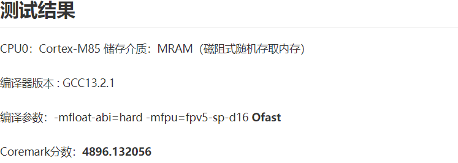
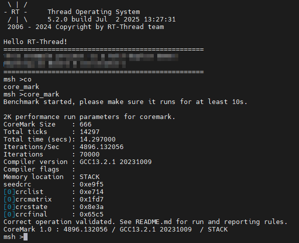
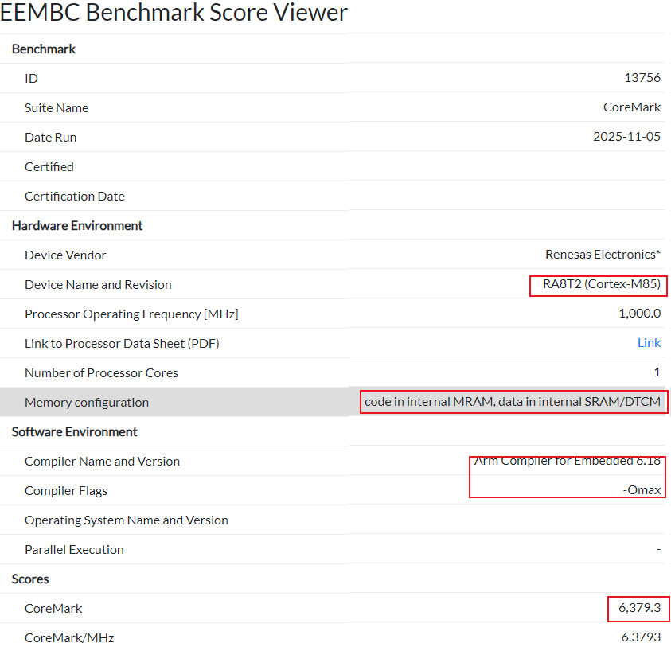
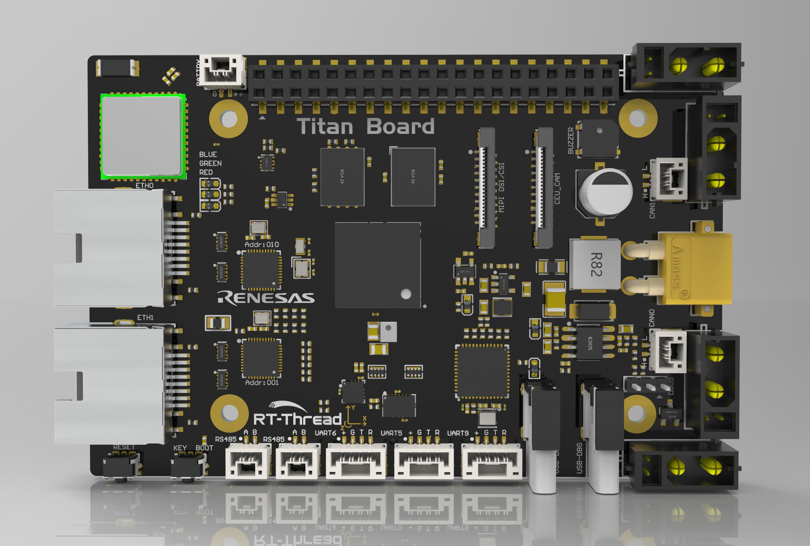
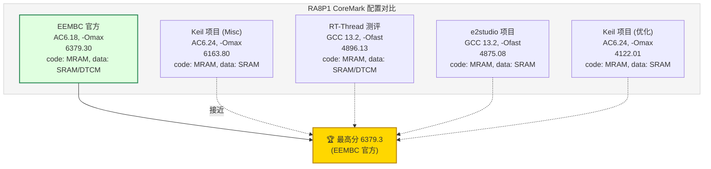

一、RA8P1 CoreMark 6300分优化配置指南
===
[toc]

# 一、概述

- 本文旨在解析如何通过关键配置，将RA8P1（Cortex-M85内核）的CoreMark分数提升至官网登记的6300分。

- 内容涵盖编译器优化选项、链接时优化（LTO）、以及关键的硬件特性（如Cache和TCM）配置。

# 二、资料来源
- [RA8P11GHz Arm Cortex-M85 和 Ethos-U55 NPU](https://www.renesas.cn/zh/products/ra8p1)
- [EEMBC CoreMark官网数据](https://www.eembc.org/viewer/?benchmark_seq=13756)

- [ARM Cortex-M85产品](https://www.arm.com/zh-cn/products/silicon-ip-cpu/cortex-m/cortex-m85)
- [CM85简介](https://armkeil.blob.core.windows.net/developer/Files/pdf/product-brief/arm-cortex-m85-product-brief.pdf)
- [Performance-Scale](https://developer.arm.com/compare-ip/#cortex-m-cpu-performance---scalar)

- GCC/Clang LTO技术文档等：
    - https://www.keil.com/appnotes/files/apnt\_298.pdf
    - https://www.gnu.org/software/gcc/projects/lto/lto.pdf
    - https://software-dl.ti.com/codegen/docs/tiarmclang/compiler\_tools\_user\_guide/compiler\_manual/link\_time\_optimization/index.html
    - https://kb.segger.com/Link\_Time\_Optimization

- RT-thread Titan:

    - https://club.rt-thread.org/ask/article/3387ad4472d12ead.html
    - https://club.rt-thread.org/ask/article/9367fd1549231fb8.html
    - https://github.com/RT-Thread-Studio/sdk-bsp-ra8p1-titan-board
    - https://rt-thread-studio.github.io/sdk-bsp-ra8p1-titan-board/latest/index_zh.html
    - https://gitee.com/RT-Thread-Studio-Mirror/sdk-bsp-ra8p1-titan-board

# 三、RT-Thread测评RA8P1 coremark

- **日志：CoreMark 1.0 : 4896.132056 / GCC13.2.1**




# 四、EEMBC Benchmark RA8P1

- **Scores CoreMark 6,379.3**
  


# 五、使用Titan Board挑战coremark 6300



## 5.1 e2studio项目

- 1、daplink转jlinkob，见资料链接
- 2、
    - ra8p1_coremark_gcc
    - ra8t2_coremark_gcc
    - ra8t2_coremark_iarbuild
    - ra8t2_coremark_llvm
- **3、日志：CoreMark 1.0 : 4875.076173 / GCC13.2.1**
```

[14:46:31.913]收←◆
Toolchain ver:13.2.1 20231009
date:Mar 28 2026
time:21:45:54
file:../src/hal_entry.c
func:hal_entry,line:127
hello world!
MPU supports 8 regions
Region 0: 0x68000000-0x67FFFFE0, AttrIndex=0
Region 1: 0x80000000-0x7FFFFFE0, AttrIndex=0
Region 2: 0x70000000-0x6FFFFFE0, AttrIndex=0
Region 3: 0x220001E0-0x220001C0, AttrIndex=0
Region 4: Disabled
Region 5: Disabled
Region 6: Disabled
Region 7: Disabled
start coremain!

[14:46:48.359]收←◆2K performance run parameters for coremark.
CoreMark Size    : 666
Total ticks      : 16410
Total time (secs): 16.410000
Iterations/Sec   : 4875.076173
Iterations       : 80000
Compiler version : GCC13.2.1 20231009
Compiler flags   : Please put compiler flags here (e.g. -ofast)
Memory location  : STACK
seedcrc          : 0xe9f5
[0]crclist       : 0xe714
[0]crcmatrix     : 0x1fd7
[0]crcstate      : 0x8e3a
[0]crcfinal      : 0xcc42
Correct operation validated. See README.md for run and reporting rules.
CoreMark 1.0 : 4875.076173 / GCC13.2.1 20231009 Please put compiler flags here (e.g. -ofast) / STACK
terminated coremain!
running!

```

## 5.3 Keil项目
### 5.3.1 Optimization:-Omax
- Keil MDK的 Project -> Options for Target -> C/C++ AC6 -> **Optimization:-Omax**
- **日志：CoreMark 1.0 : 4122.011542 Clang 20.0.0git**

```
[22:24:58.345]收←◆2K performance run parameters for coremark.
CoreMark Size    : 666
Total ticks      : 19408
Total time (secs): 19.408000
Iterations/Sec   : 4122.011542
Iterations       : 80000
Compiler version : GCCClang 20.0.0git
Compiler flags   : Please put compiler flags here (e.g. -ofast)
Memory location  : STACK
seedcrc          : 0xe9f5
[0]crclist       : 0xe714
[0]crcmatrix     : 0x1fd7
[0]crcstate      : 0x8e3a
[0]crcfinal      : 0xcc42
Correct operation validated. See README.md for run and reporting rules.
CoreMark 1.0 : 4122.011542 / GCCClang 20.0.0git Please put compiler flags here (e.g. -ofast) / STACK
terminated coremain!
running!
```
### 5.3.2 Misc Controls:-Omax

- Keil MDK的 Project -> Options for Target -> C/C++ AC6 -> **Misc Controls:-Omax**
- Keil MDK的 Project -> Options for Target -> C/C++ AC6 -> **Misc Controls: --via=./via/rasc_armasm.via
  **\via\rasc_armclang.via  -Os -> -Omax**
- **CoreMark 1.0 : 6163.803066 Clang 20.0.0git**
```
[22:25:17.808]收←◆2K performance run parameters for coremark.
CoreMark Size    : 666
Total ticks      : 12979
Total time (secs): 12.979000
Iterations/Sec   : 6163.803066
Iterations       : 80000
Compiler version : GCCClang 20.0.0git
Compiler flags   : Please put compiler flags here (e.g. -ofast)
Memory location  : STACK
seedcrc          : 0xe9f5
[0]crclist       : 0xe714
[0]crcmatrix     : 0x1fd7
[0]crcstate      : 0x8e3a
[0]crcfinal      : 0xcc42
Correct operation validated. See README.md for run and reporting rules.
CoreMark 1.0 : 6163.803066 / GCCClang 20.0.0git Please put compiler flags here (e.g. -ofast) / STACK
terminated coremain!
running!
```

# 六、为什么需要精细配置

RA8P1搭载了ARM最新的Cortex-M85内核，虽然其本身具备强大的处理能力，但要发挥其全部性能潜力，尤其是达到CoreMark 6300分这样的高水平，单纯的默认配置是不够的。CoreMark是一个高度依赖编译器优化和内存访问速度的基准测试程序。为了达到官方登记的性能数据，我们需要进行“榨干式”的配置，让编译器生成最高效的指令，并让CPU能够以最快速度访问数据和指令。




# 七、总结

RA8P1 (Cortex-M85) 达到6300 CoreMark分数并非偶然，它是高性能硬件与极致软件优化的结合。

关键优化手段优先级：

1. 编译器优化：必须使用最高级别优化 `-Omax`，并启用浮点、向量化和循环优化选项。

2. 链接时优化 (LTO)：对于跨文件的性能敏感代码，LTO是必不可少的。

3. 硬件资源利用：Dcache+sram 和 TCM 的速度没有明显的差异，但TCM直接访问，没有cache缓存相关问题。

理解编译器选项和硬件架构是进行深度优化的基础。不同的应用场景可能需要不同的优化策略，但上述配置方案为榨干Cortex-M85性能提供了一个清晰的模板。


