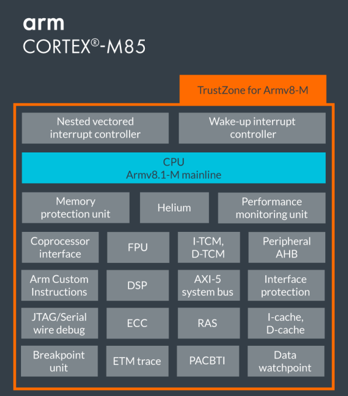
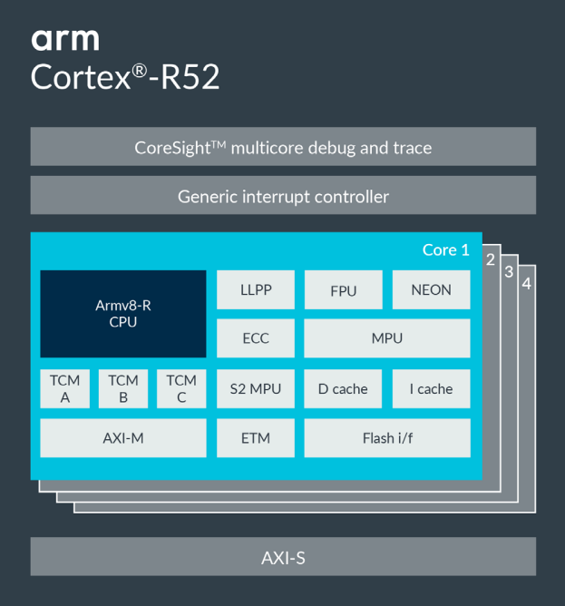
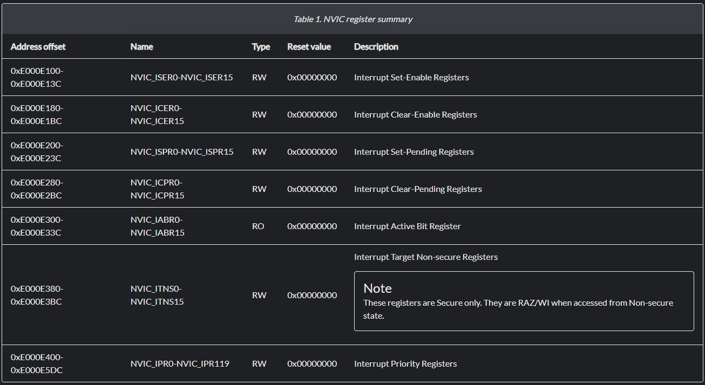
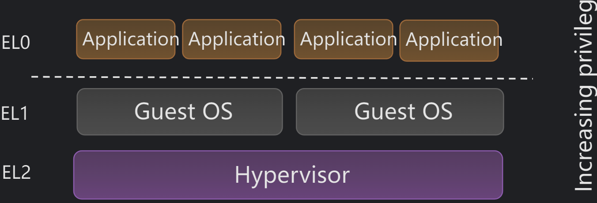
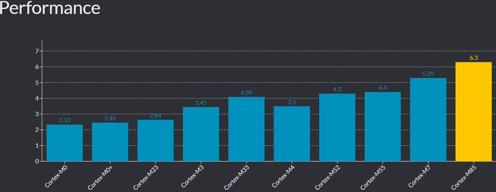
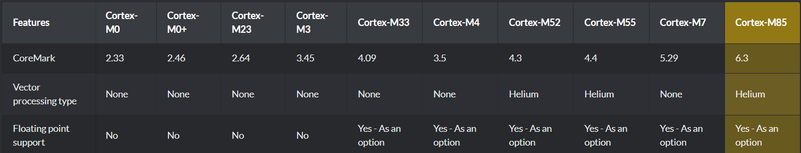
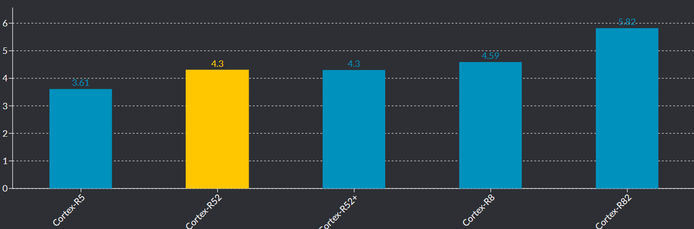
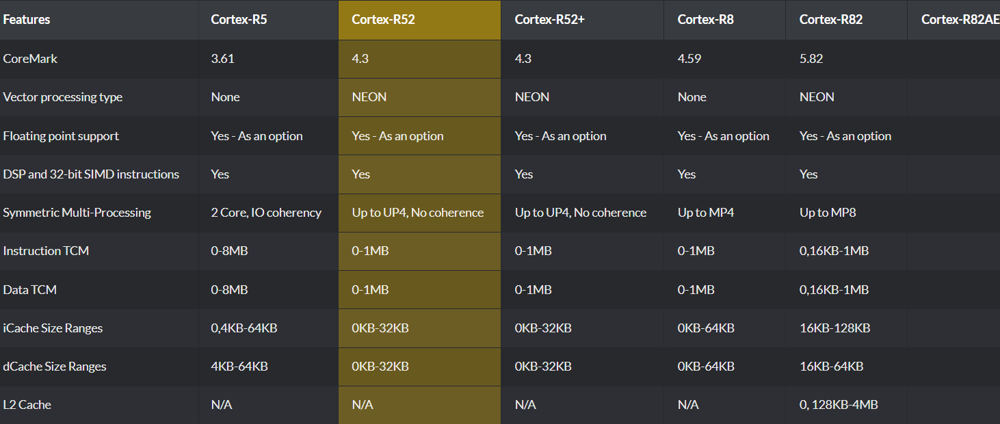
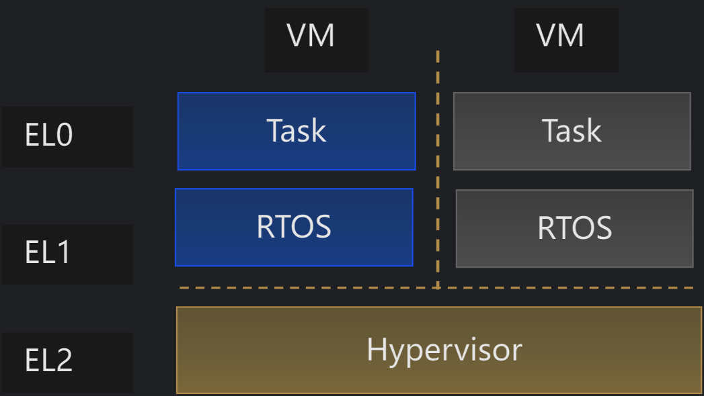
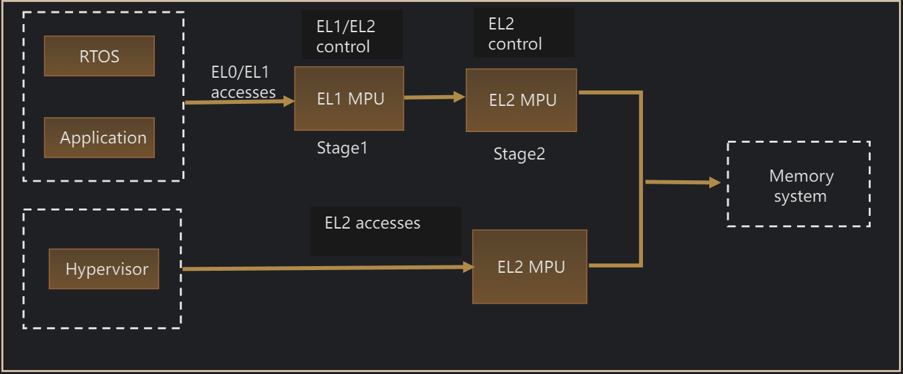

二、CM85和CR52两个内核对比
===
[toc]

# 一、概述
- 如何理解瑞萨的RA8和RZT2/N2有部分重叠的应用
- 本来通过对CM85和CR52两个内核对比，来体会芯片设计的区别

# 二、资料来源
- https://www.arm.com/zh-cn/products/silicon-ip-cpu/cortex-m/cortex-m85
- https://www.arm.com/zh-cn/products/silicon-ip-cpu/cortex-r/cortex-r52
- [arm-cortex-m85-product-brief.pdf](./doc/arm-cortex-m85-product-brief.pdf)
- [arm-cortex-r52-product-brief.pdf](./doc/arm-cortex-r52-product-brief.pdf)
- https://developer.arm.com/compare-ip/#cortex-m-cpu-performance---scalar
- https://developer.arm.com/documentation/109997/100/Virtualization
- https://developer.arm.com/documentation/101924/0101/Overview/Cortex-M85-processor-overview?lang=en

# 三、Cortex-M85 vs Cortex-R52 内核关键差异对比表

| 对比维度 | Cortex-M85 | Cortex-R52 |
| :--- | :--- | :--- |
| 架构 | ARMv8.1-M Mainline | ARMv8-R |
| **设计目标** | **极致性能**（标量、DSP、ML），端点AI | **实时性、功能安全、虚拟化** |
| **多核支持** | 支持双核锁步（DCLS，可选） | **原生最多4核**，每核可配锁步，最多8逻辑核 |
| **安全特性** | TrustZone + PACBTI（防ROP/JOP攻击） | **虚拟化**（Hypervisor）+ 两阶段MPU，面向ISO 26262 |
| **SIMD/向量技术** | **Helium**（M向量扩展） 针对低功耗嵌入式优化，支持每通道预测、低开销循环 | **NEON**（高级SIMD） 针对高性能多媒体设计，吞吐量更高，面积功耗更大 |
| **调试与追踪** | 内置调试：JTAG/SW + ETM + 断点/观察点 **仅限单核**，跟踪路径简单 | **CoreSight** 完整系统： 支持**多核交叉触发**、复杂跟踪网络（Funnel/Replicator）、多种跟踪终点（ETB/ETF/ETR） |
| **内存系统** | TCM（I/D各最大**16MB**），缓存（I/D各最大**64KB**），**MPU 16**区域 | TCM（最多3个，**各1MB**），缓存（D-cache最大**32KB**），两阶段**MPU 24**区域 |
| 总线接口 | AXI-5（64位），两个Peripheral AHB | AXI-M（128位）、AXI-S、LLPP、Flash I/F |
| 特殊扩展 | Arm自定义指令、协处理器接口、DSP | FPU（单/双精度）、NEON |
| **可靠性** | ECC（TCM/缓存）、RAS | **全路径ECC**（TCM/缓存/总线）、BIST、软件测试库、总线互连保护 |
| **典型应用** | 高端MCU、端点AI、智能传感器、物联网网关 | 汽车动力总成/底盘、安全岛、工业控制器 |

# 四、各个差异
## 4.1 内核数量

## 4.2 MPU(Memory Protection Unit)数量

- **16 VS 24**

## 4.3 TCM和cache大小

- ICache 64kB-----------ICache 32kB
- DCache 64kB---VS---ICache 32kB
- ITCM 16MB------------TCM 3x1MB
- DTCM 16MB

## 4.4 SIMD/向量技术

- **Helium VS NEON**
  
| 对比维度 | **NEON** | **Helium (MVE)** |
| :--- | :--- | :--- |
| **本质** | SIMD（单指令多数据流）技术 | SIMD（单指令多数据流）技术 |
| **所属架构** | ARMv7-A / ARMv8-A（Cortex-A系列） | ARMv8.1-M（Cortex-M系列） |
| **目标场景** | 高性能多媒体、应用处理器（手机、平板等） | 低功耗嵌入式、端点AI、物联网设备 |
| **寄存器宽度** | 128位 | 128位 |
| **支持数据类型** | 整数、单精度浮点（AArch64下支持双精度） | 整数、单精度浮点、半精度浮点 |
| **独特功能** | 融合乘加、双发射等复杂流水线优化 | 向量长度尾数处理、每通道预测、低开销循环 |
| **设计侧重** | 追求极致吞吐量，可牺牲面积和功耗 | 在面积和功耗受限下最大化SIMD效率 |
| **性能表现** | 极高（适合密集计算） | 比传统Cortex-M提升数倍，但低于NEON |
| **典型应用** | 视频编解码、3D图形、图像处理 | 语音识别、传感器融合、小型机器学习 |

## 4.5 中断

- **NVIC VS GIC**

## 4.6 cpu性能 coremark

- **CoreMark/MHz 6.28 VS 4.3**
  

## 4.7 CR52 虚拟化Virtualization
- https://developer.arm.com/documentation/109997/100/Virtualization
- **单核运行2个OS**
  
  
  

## 4.8 典型应用

- **高性能 VS 实时性+安全**

  
  

# 五、总结
- 内核设计目标：**极致性能** VS **实时性、功能安全、虚拟化**，决定了性能和应用的差异
- 因为内核的区别，带来了RA8和RZT2/N2 电源和存储的区别
- 从内核的区别，再回头对比RA8和RZT2/N2是否有一些新的更深的理解呢？