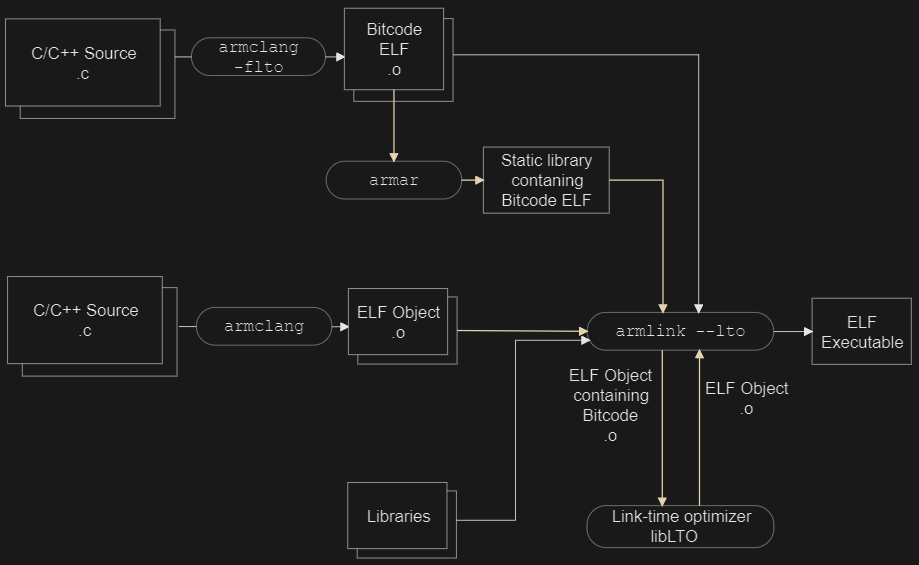

三、RA8D1 CoreMark测试GCC vs AC6和分散加载浅析
===
[toc]

# 一、概述
- RA8D1 搭载 Cortex-M85 内核，主频 480MHz
- 使用 GCC(13.3.1) 和 AC6(Clang 20.0.0git) 两种工具链编译 CoreMark
- 测试不同优化等级、内存布局（Cache+SRAM、TCM）对跑分的影响

# 二、测试环境
| 项目 | 参数 |
| :--- | :--- |
| 芯片 | RA8D1 |
| 内核 | Cortex-M85 |
| 主频 | 480MHz |
| GCC 版本 | 13.3.1 20240614 |
| AC6 版本 | Clang 20.0.0git |
| CoreMark Size | 666 (2K) |
| Iterations | 80000 |

# 三、GCC 跑分结果

## 3.1 测试配置与结果

| 编号 | 配置 | Iterations/Sec | CoreMark/MHz |
| :--- | :--- | :--- | :--- |
| 1 | -Ofast + fsp.ld（默认链接） | 2286.37 | **4.76** |
| 2 | -Ofast + fsp.ld + stack 放 DTCM | 2343.57 | **4.88** |
| 3 | -Ofast + fsp_tcm.ld（TCM链接） | 2341.30 | **4.88** |
| 4 | -Ofast + fsp_tcm.ld + stack 放 DTCM | 2341.37 | **4.88** |

## 3.2 GCC 结果分析
- **默认链接脚本**：4.76 CoreMark/MHz，基线成绩
- **Stack 放入 DTCM**：提升到 4.88 CoreMark/MHz，提升约 2.5%
- **TCM 链接脚本**：与 stack 放 DTCM 效果接近，约 4.88 CoreMark/MHz
- GCC 下 TCM 带来的收益有限，说明代码主要已在 Cache 中命中

# 四、AC6 跑分结果

- [./prj/ra8d1_coremark_ac6/](./prj/ra8d1_coremark_ac6/)
- [./prj/ra8d1_coremark_gcc/](./prj/ra8d1_coremark_gcc/)

## 4.1 测试配置与结果

| 编号 | 配置 | Iterations/Sec | CoreMark/MHz |
| :--- | :--- | :--- | :--- |
| 1 | -Ofast + stack 放 DTCM | 2688.35 | **5.60** |
| 2 | -Ofast + stack 放 DTCM + fsp_tcm.scat | 2683.30 | **5.59** |
| 3 | -Omax + fsp_tcm.scat | 2780.77 | **5.79** |
| 4 | -Omax + fsp.scat（默认链接） | 2780.77 | **5.79** |
| 5 | -Omax + stack 放 DTCM | 2974.97 | **6.20** |

## 4.2 AC6 结果分析
- **-Ofast 基线**：5.60 CoreMark/MHz，已明显高于 GCC 的 4.88
- **-Omax（开启 LTO）**：5.79 CoreMark/MHz，比 -Ofast 提升约 3.4%
- **-Omax + stack 放 DTCM**：**6.20 CoreMark/MHz**，最高成绩
- AC6 整体比 GCC 高约 27%（5.60 vs 4.76 基线对比）

# 五、GCC vs AC6 对比汇总

| 对比维度 | GCC (-Ofast) | AC6 (-Ofast) | AC6 (-Omax) |
| :--- | :--- | :--- | :--- |
| 基线（默认链接） | 4.76 | 5.60 | 5.79 |
| Stack 放 DTCM | 4.88 | 5.60 | **6.20** |
| TCM 链接脚本 | 4.88 | 5.59 | 5.79 |
| **最高成绩** | **4.88** | **5.60** | **6.20** |

# 六、AC6 优化等级与 LTO 详解

## 6.1 -Ofast vs -Omax

| 优化等级 | LTO | 说明 |
| :--- | :--- | :--- |
| **-Ofast** | 不启用 | 激进优化，但不做跨模块链接时优化。允许浮点重结合等可能违反标准合规的变换 |
| **-Omax** | **默认启用** | 最大优化，等价于 `-O3 -flto`。启用所有优化包括跨模块内联、死代码消除和链接时优化 |

## 6.2 什么是 LTO（Link Time Optimization）

LTO 是一种**跨模块的过程间优化**，在链接阶段而非编译阶段执行：

1. **编译阶段**：armclang 使用 `-flto` 时生成 **bitcode**（字节码）文件，而非标准 ELF 对象文件。Bitcode 包含源代码的中间表示（IR）和模块依赖信息
2. **链接阶段**：armlink 处理 bitcode 文件，提取模块依赖信息，传递给 llvm-lto 工具
3. **优化阶段**：链接时优化器分析所有模块，移除未使用函数/数据，执行跨模块内联，生成优化后的 ELF 对象
4. **最终链接**：优化后的对象与其他 ELF 对象和预编译库链接，生成最终可执行文件

- https://developer.arm.com/documentation/100748/0624/Writing-Optimized-Code/Optimizing-across-modules-with-Link-Time-Optimization/Restrictions-with-Link-Time-Optimization
- https://developer.arm.com/documentation/100748/0624/Writing-Optimized-Code/Optimizing-across-modules-with-Link-Time-Optimization

- [Arm® Compiler for Embedded Version 6.24 Reference Guide](./doc/arm_compiler_reference_guide_101754_0624_02_en.pdf)
- [Arm® Compiler for Embedded Version 6.24 User Guide](./doc/arm_compiler_user_guide_100748_0624_02_en.pdf)

## 6.3 LTO 对 Scatter File（TCM 放置）的限制

LTO 的核心问题是**原始对象文件边界被打破**：

- **对象合并**：LTO 将所有 bitcode 合并为 `lto-llvm-xxxxx.o` 这样的单一对象，原始 `.o` 文件不再独立存在
- **Section 属性丢失**：`__attribute__((section(".dtcm")))` 指定的段属性在 bitcode 合并过程中可能被合并或重命名
- **Scatter 文件匹配失败**：scatter 文件中基于对象名的模式（如 `version.o (+RO)`）将无法匹配，产生 **L6314W** 警告

### 具体表现

| 问题 | 说明 |
| :--- | :--- |
| 对象名引用失效 | scatter 文件中无法使用 `xxx.o` 显式引用对象，因为代码已被合并到 `lto-llvm-xxxxx.o` |
| Section 属性可能被合并 | 命名段可能无法在 bitcode 合并过程中保留 |
| RAM 函数放置异常 | 通过 scatter 文件放入 RAM 的函数可能被内联到 Flash 函数中，破坏原有放置 |

### Arm 官方建议

> "Scatter-loading of LTO objects is supported but it's recommended for code and data that **doesn't have a strict placement requirement**."
> — Arm Employee, Arm Community

## 6.4 如何规避 LTO 限制

| 方法 | 操作 |
| :--- | :--- |
| **换用 -Ofast** | 不使用 -Omax，避免 LTO，scatter 文件正常工作 |
| **部分文件禁用 LTO** | 对需要严格放置的文件编译时加 `-fno-lto`，其余文件保持 `-flto` |
| **链接器禁用 LTO** | 使用 `--no_lto` 参数 |
| **使用段名而非对象名** | scatter 文件中使用 `*(.dtcm)` 而非 `xxx.o (.dtcm)`（不保证可靠） |

## 6.5 本次测试中的体现

- 配置 3（-Omax + fsp_tcm.scat）与配置 4（-Omax + fsp.scat）成绩相同（2780.77），说明 **LTO 开启后 scatter 文件的 TCM 放置可能未生效**
- 配置 5（-Omax + stack 放 DTCM）达到最高 2974.97，说明通过 `__attribute__((section()))` 直接指定 stack 位置的方式在 LTO 下仍然有效
- 若需要 scatter 文件精确控制 TCM 放置，建议使用 `-Ofast` 而非 `-Omax`

# 七、总结

- **AC6 优于 GCC**：AC6 基线成绩比 GCC 高约 27%，编译器优化能力更强
- **-Omax 最快但有代价**：LTO 带来额外 3-6% 性能提升，但限制了 scatter 文件的 TCM 精确放置
- **TCM 收益**：Stack 放入 DTCM 在两种工具链下都有正向收益，AC6 下提升更明显
- **最佳实践**：追求极致性能用 AC6 -Omax + stack 放 DTCM（6.20 CoreMark/MHz）；需要精确内存布局用 AC6 -Ofast
