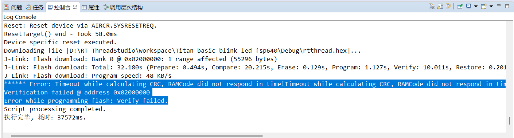
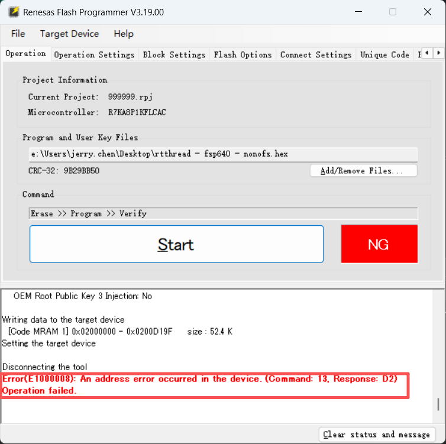
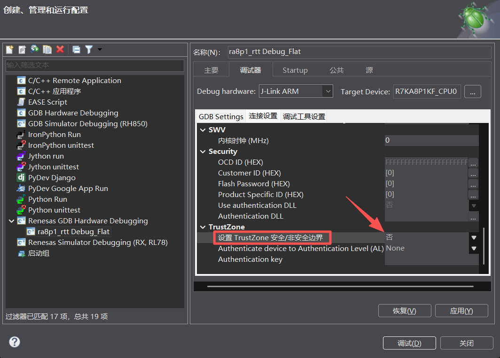
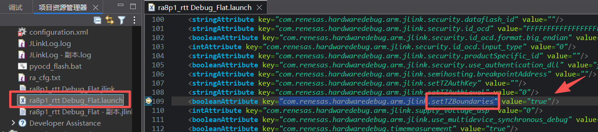
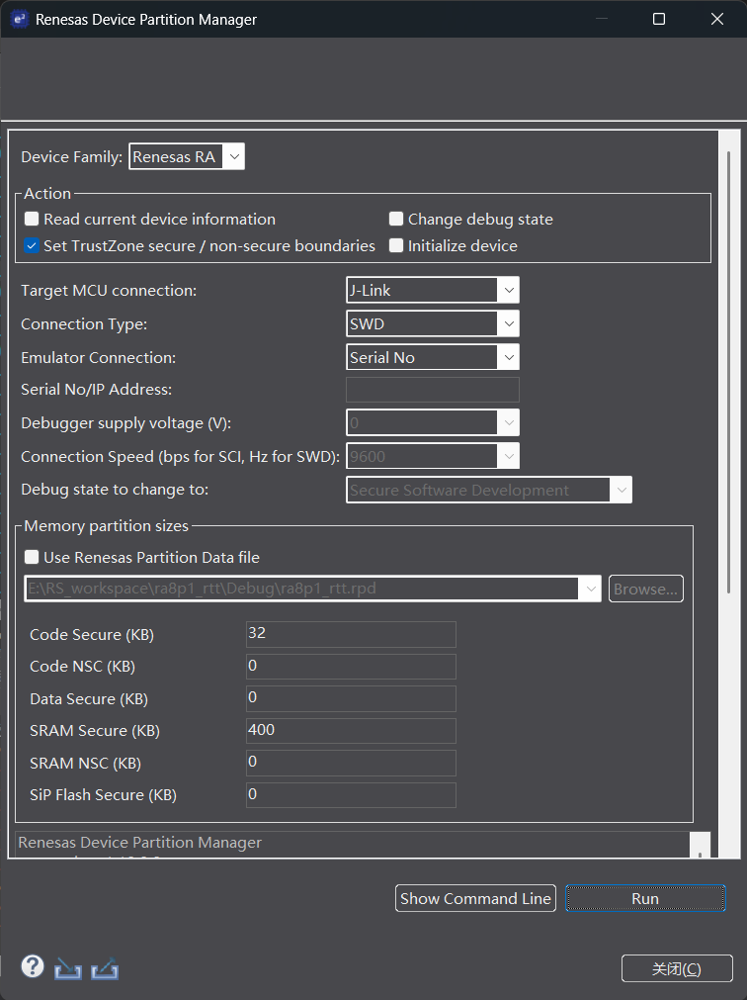
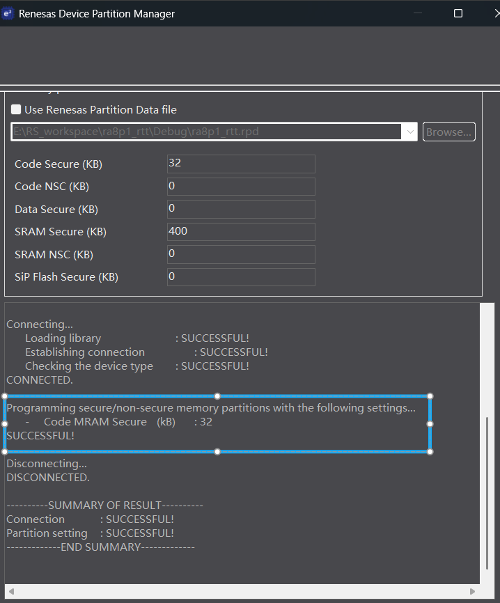
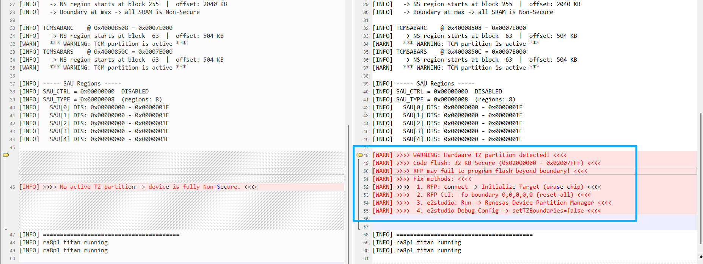

五、RA8P1 TrustZone分区引发的烧录问题深度调查
===
[toc]

# 一、背景

RA8P1 Titan Board（Cortex-M85，1GHz）**在使用 e2studio 调试下载后再去下载 RT-Thread 的任何工程都会失败**，Renesas Flash Programmer（RFP）也一样报错。这个问题严重影响了开发效率，本文记录了从发现问题到定位根因再到形成诊断工具的完整调查过程。

# 二、调查进展

整个调查过程的逐步推进如下：

| 步骤 | 发现 | 进展 |
|------|------|------|
| 第 1 步 | 用 RFP init 能临时恢复，但不知道根本原因 | 现象确认，原因未知 |
| 第 2 步 | 发现 `setTZBoundaries` 开关，关闭后问题消失 | 锁定关联因素 |
| 第 3 步 | 使用 RDPM 设置同样 32KB 分区后 RFP 同样失败 | 确认是分区配置本身导致的问题 |
| 第 4 步 | hex 文件 52.4KB 远大于 32KB Secure 分区，RFP 报 Command:13, Response:D2 | 找到直接原因：写入超边界 |
| 第 5 步 | JLink 读取 CFSAMONA 从 `0x00FF8000` 变为 `0x00008000` | 寄存器级验证根因 |
| 第 6 步 | 查阅 FSP 文档确认分区存储在专用非易失性区域，仅启动模式可读写 | 理解持久化机制 |
| 第 7 步 | 编写 `bsp_tz_monitor.c`，启动时打印状态警告开发者 | 形成诊断工具固化经验 |

# 三、问题现象

## 3.1 e2studio 调试后 RT-Thread Studio 无法下载

使用 e2studio 调试下载 RT-Thread 工程后，再用 RT-Thread Studio 下载任何工程都会失败：

```
****** Error: Timeout while calculating CRC, RAMCode did not respond in time!
Timeout while calculating CRC, RAMCode did not respond in time!
Timeout while calculating CRC, RAMCode did not respond in time!
Verification failed @ address 0x02000000
Error while programming flash: Verify failed.
```



## 3.2 RFP 也报错

用瑞萨官方 RFP 软件下载同样失败：

```
Error(E1000008): An address error occurred in the device. (Command: 13, Response: D2)
Operation failed.
```



## 3.3 已知的临时解决方案

根据 [RT-Thread Titan 开发板 FAQ](https://rt-thread-studio.github.io/sdk-bsp-ra8p1-titan-board/latest/faq/FAQ_page/README_zh.html#q5) 的说明——用 RFP 执行 Initialize Target（擦除芯片）可以恢复。但这只是治标不治本，我们需要知道问题产生的根源。

# 四、调查过程

## 4.1 第一步：发现 setTZBoundaries 开关

在调查 e2studio 的 Debug Configurations 时，发现有一个 **TrustZone boundary** 相关的配置选项：



对应的 `.launch` 文件中有这样一个属性：

```xml
<booleanAttribute key="com.renesas.hardwaredebug.arm.jlink.setTZBoundaries" value="true"/>
```

将其改为 `false` 后，问题不再出现，一切恢复正常。



这说明问题与 TrustZone 边界配置有直接关系。

## 4.2 第二步：RDPM 工具验证

e2studio 中还有一个 **Run → Renesas Device Partition Manager(RDPM)** 工具：



RDPM 可以手动设置 Secure/Non-Secure 分区大小：



使用 RDPM 设置 32KB Code MRAM Secure 分区后的日志给了我们重要启发：

```
Connecting...
	Loading library				: SUCCESSFUL!
	Establishing connection			: SUCCESSFUL!
	Checking the device type		: SUCCESSFUL!
CONNECTED.

Programming secure/non-secure memory partitions with the following settings...
	-	Code MRAM Secure	(kB)	: 32
SUCCESSFUL!

Disconnecting...
DISCONNECTED.
```

设置完成后，RFP 再次报同样的 `Error(E1000008)` 错误。这说明 **RDPM 与 setTZBoundaries=true 最终达到的效果是一样的**——都配置了 32KB 的 Secure 分区。

## 4.3 第三步：豁然开朗——hex 文件大小

回头看我们的 RT-Thread hex 文件：

```
Writing data to the target device
  [Code MRAM 1] 0x02000000 - 0x0200D19F     size : 52.4 K
```

**52.4KB 远大于 32KB 的 Secure 分区！**

RDPM 日志说 "Code MRAM Secure: 32KB"，即 flash 前 32KB 被标记为 Secure 区域。我们的 hex 要从 `0x02000000` 写到 `0x0200D19F`，但 `0x02008000` 之后属于 Non-Secure 区域。RFP 以 Non-Secure 权限连接设备，试图写 Secure 区域之外的地址时，硬件 TrustZone Filter（TZF）直接拦截，报地址错误：

```
Error(E1000008): An address error occurred in the device. (Command: 13, Response: D2)
```

> **Command 13** 是 RFP 的写入命令，**Response D2** 表示 TZ 安全违规。

## 4.4 第四步：寄存器级验证

为了从硬件层面验证，我们通过 JLink Commander 读取了相关的 TrustZone 状态寄存器。

**关键寄存器：CFSAMONA（Code Flash Security Attribution Monitor）**

| 条件 | 寄存器值 | 解码 | 含义 |
|------|---------|------|------|
| `setTZBoundaries=false` | `0x00FF8000` | CFS2=511 blocks | 边界超出 flash 末尾 → 全部 Non-Secure |
| `setTZBoundaries=true` | `0x00008000` | CFS2=1 block | **32KB Secure + 剩余 Non-Secure** |

完整的三组寄存器总结：

| 寄存器 | 地址 | 属性 | 说明 |
|--------|------|------|------|
| `CFSAMONA.CFS2` | `0x40204030` [23:15] | 只读监视器 | Code flash Secure 块数（每块 32KB） |
| `SFSAMON.SFS` | `0x4020403C` [23:15] | 只读监视器 | SiP flash Secure 块数 |
| `DLMMON` | `0x40204038` [3:0] | 只读监视器 | DLM 生命周期状态 |
| `SRAMSABAR0-3` | `0x40008400-0x4000840C` [20:13] | 读写 | SRAM 安全边界 |
| `TCMSABARC/S` | `0x40008508/0x4000850C` [18:13] | 读写 | TCM 安全边界 |

## 4.5 第五步：深挖分区存储机制

进一步研究发现，RA8P1 的 TrustZone 分区信息并非存储在普通的代码 flash 或 OFS（选项设置内存）区域，而是存储在 **专用的非易失性存储区域**，只能通过 SCI/USB 启动模式命令进行读写。RDPM 和 e2studio 的调试器固件会自动将 MD 引脚拉低进入启动模式来完成分区编程。

| 存储位置 | 说明 |
|----------|------|
| ❌ 代码 flash (`0x02000000`+) | 不存储分区信息 |
| ❌ OFS 区域 (`0x02C9F040`+) | 存储 WDT、ECC、LVD 等选项，不存储分区 |
| ✅ 专用非易失性存储 | 仅可通过启动模式命令读写，内存不可见 |
| ✅ CFSAMONA 寄存器 | 启动时硬件自动加载分区信息至此只读监视器 |

这就是为何断电后问题依然存在——分区信息存储在非易失性介质中，JLink 常规 `mem32` 无法直接读取分区存储区，但可以通过 CFSAMONA 寄存器间接观察分区效果。

# 五、形成诊断工具

基于以上调查，我们编写了 `bsp_tz_monitor.c` 诊断模块，在芯片初始化阶段调用 `bsp_tz_monitor_print()` 即可打印所有 TrustZone 相关寄存器的状态。如果检测到分区配置，会给出明确的警告和修复指引。

## 5.1 使用方法

在 `hal_entry()` 中调用：

```c
#include "bsp_tz_monitor.h"

void hal_entry(void)
{
    // 初始化代码...
    bsp_tz_monitor_print();      // 打印 TZ 状态
    // 应用代码...
}
```

## 5.2 正常状态输出（无分区）



```
===== TrustZone Security Monitor =====
DLM  @ 0x40204038 = 0x00000004  -> OEM_PL1

CFSAMONA     @ 0x40204030 = 0x00FF8000
  -> Secure blocks: 511  |  Secure size: 16352 KB
  -> Boundary exceeds flash end -> entire flash is Non-Secure
...

>>>> No active TZ partition -> device is fully Non-Secure. <<<<
========================================
```

完整日志见 [`1.log`](1.log)

## 5.3 异常状态输出（32KB Secure 分区）

```
===== TrustZone Security Monitor =====
DLM  @ 0x40204038 = 0x00000004  -> OEM_PL1

CFSAMONA     @ 0x40204030 = 0x00008000
  -> Secure blocks:   1  |  Secure size: 32 KB
  -> Secure: 0x02000000 - 0x02007FFF  (32 KB)
  -> Non-Secure alias: 0x12008000 - 0x12107FFF
  *** WARNING: CFSAMONA has 32 KB Secure region active! ***

>>>> WARNING: Hardware TZ partition detected! <<<<
>>>> Fix methods: <<<<
>>>>  1. RFP: connect -> Initialize Target (erase chip) <<<<
>>>>  2. RFP CLI: -fo boundary 0,0,0,0,0 (reset all) <<<<
>>>>  3. e2studio: Run -> Renesas Device Partition Manager <<<<
>>>>  4. e2studio Debug Config -> setTZBoundaries=false <<<<
========================================
```

完整日志见 [`2.log`](2.log)

## 5.4 源代码

-   `src/bsp_tz_monitor.h` — 函数声明
-   `src/bsp_tz_monitor.c` — 寄存器读取、解码、打印实现

# 六、相关资料

| 资料 | 来源 | 说明 |
|------|------|------|
| R7KA8P1KF_core0.h | FSP CMSIS 设备头文件 | 寄存器定义和地址映射 |
| core_cm85.h | CMSIS 6 | Cortex-M85 核心寄存器定义（SAU 等） |
| bsp_security.c | FSP BSP | `R_BSP_SecurityInit()` SAU/IDAU 初始化逻辑 |
| bsp_feature.h | FSP BSP RA8P1 | `BSP_FEATURE_TZ_HAS_DLM=1`、`__SAUREGION_PRESENT=1` |
| rfp-cli.md | RFP 文档 | `-fo boundary` 命令说明 |
| english.xml | e2studio 插件 | `IDS_RA_BOUNDARY_PROGRAM_SUCCESSFUL` 等提示 |
| RA8_CM85_dual.grp | e2studio MCU 文件 | `TrustZoneTypeSettings=2`、`AuthAp=2`、`MemAp=1` |
| RA8P1_Extra.mbl | e2studio MCU 文件 | 选项设置内存（OFS）地址 `0x02C9F040` |
| FSP 用户手册 | RASC 文档 | DLM 设备分区存储在非易失性内存中，通过启动模式编程 |
| Renesas Device Partition Manager.pdf | e2帮助 | 见doc文件夹 |
| device-lifecycle-mgmt-ra8.pdf | 官网 | 见doc文件夹 |

# 七、总结

## 7.1 根因流程图

```
e2studio Debug 启动
        │
        ▼
setTZBoundaries=true（默认）
        │
        ├──→ DLA 认证（CoreSight 调试 mailbox）
        ├──→ 驱动 MD 引脚进入 SCI 启动模式
        └──→ 写入 32KB Secure 分区到专用非易失性存储
                 │
                 ▼
         芯片重新上电
                 │
                 ▼
         硬件从非易失性存储加载分区 → IDAU 配置
                 │
                 ├──→ CFSAMONA = 0x00008000（32KB Secure）
                 └──→ flash 前 32KB 标记为 Secure
                          │
                          ▼
                 RFP 以 Non-Secure 连接
                          │
                          ├──→ 试图写 0x02000000 - 0x0200D19F（52.4KB）
                          ├──→ 超过 0x02008000 边界 → TZF 拦截
                          └──→ Error(E1000008) Command:13 Response:D2
```

## 7.2 验证证据

| 证据 | 说明 |
|------|------|
| `CFSAMONA` 从 `0x00FF8000` → `0x00008000` | 32KB Secure 分区被激活 |
| `SRAMSABAR0-3` 不变 | 仅 Code flash 分区被修改，SRAM 不受影响 |
| `DLMMON = 0x04` 不变 | DLM 生命周期状态未改变，仍处于 OEM_PL1 |
| RDPM 设置相同大小后 RFP 同样失败 | 确认是分区本身而不是 e2studio 特定问题 |
| hex 大小 52.4KB > 32KB | 写入超边界导致 TZ 违规 |
| `-fo boundary` 可恢复 | 通过启动模式重写分区配置为全 Non-Secure |

## 7.3 最终结论

**RA8P1（以及所有支持 DLM 的 RA 设备）的 TrustZone 分区信息存储在专用的非易失性存储区域中**，通过 SCI/USB 启动模式命令进行编程。一旦激活，硬件 IDAU 在启动时自动加载分区配置，将 flash 划分为 Secure 和 Non-Secure 区域。

默认情况下，e2studio 的 `setTZBoundaries=true` 会在调试连接时自动写入 32KB Secure 分区。后续烧录工具（RT-Thread Studio、RFP）以 Non-Secure 权限连接设备，当烧录的固件超过 Secure 分区边界时，TrustZone Filter 直接拦截写入操作。

**推荐做法：**
- 非 TrustZone 项目：在 `.launch` 文件中设置 `setTZBoundaries=false`
- 使用 `bsp_tz_monitor_print()` 在启动时检测分区状态，提前发现潜在问题
- 遇到无法烧录时，使用 RFP Initialize Target 或 `-fo boundary 0,0,0,0,0` 恢复
