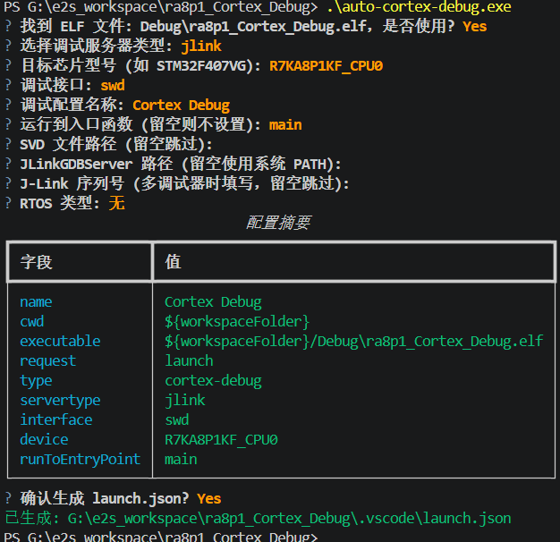
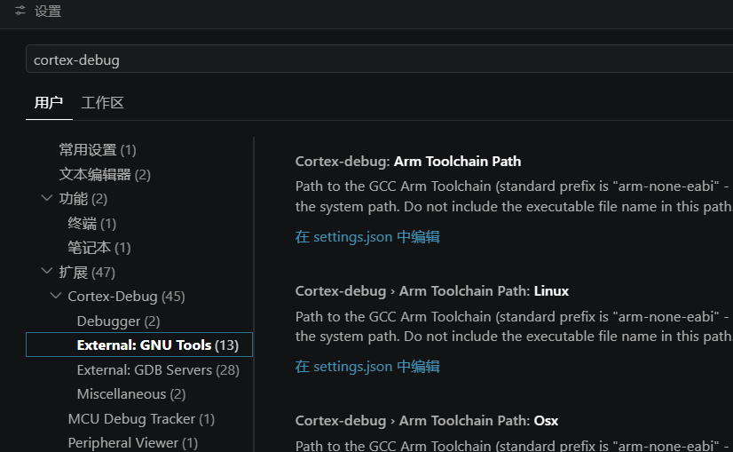
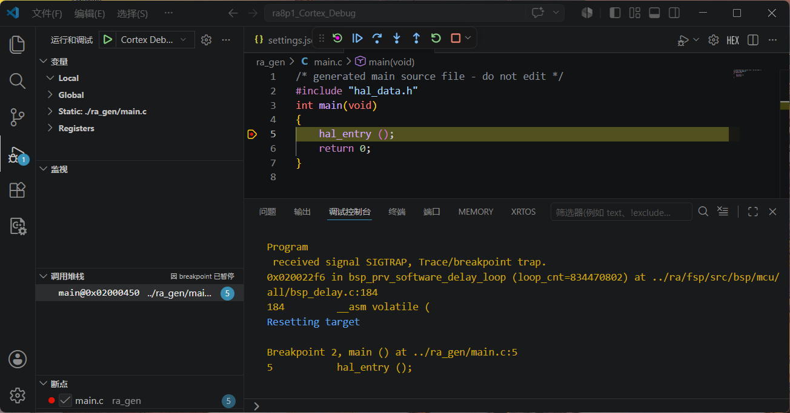
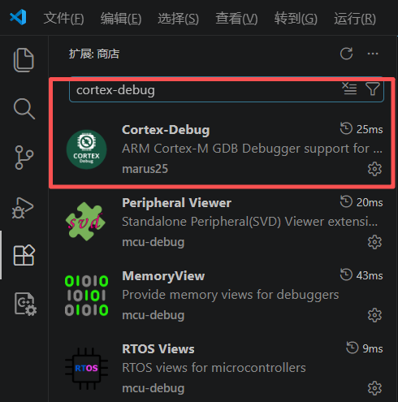

六、RA8P1 e2studio构建+VSCode Cortex-Debug调试项目
===
[toc]

# 一、背景

- RA8P1 Titan Board（Cortex-M85，1GHz）也可以使用e2studio开发，e2studio项目构建、FSP 配置等功能完善，**e2studio例程多，调试体验不如 VSCode 通用和现代**。

- 本文介绍一种**混合开发方案**：使用 e2studio 构建项目，在 VSCode 中使用 Cortex-Debug 扩展调试项目。

该方案的优势：
- e2studio 官方构建，FSP 配置器、TrustZone 等功能完整可用
- VSCode Cortex-Debug 调试更通用，断点/变量/寄存器/SVD 外设视图体验更好
- VSCode 终端也可直接编译项目，无需切换 IDE

# 二、方案概述

| 步骤 | 内容 | 工具 |
|------|------|------|
| 第 1 步 | e2studio 创建/构建项目 | e2studio |
| 第 2 步 | auto-cortex-debug 自动生成 launch.json | VSCode 终端 |
| 第 3 步 | 配置 toolchain 和 JLinkGDBServerCL 路径 | VSCode 设置 |
| 第 4 步 | F5 启动调试 | VSCode Cortex-Debug |
| 第 5 步 | （可选）VSCode 终端编译项目 | VSCode 终端 |

# 三、auto-cortex-debug 自动配置 launch.json

## 3.1 难点

对于新手，VSCode 中 Cortex-Debug 调试项目的核心难点是配置 `launch.json`，需要正确设置 ELF 路径、调试服务器、芯片型号、调试接口等多项参数，容易出错。

## 3.2 自动配置工具

我们使用 GitHub 项目 [auto-cortex-debug](https://github.com/moecly/auto-cortex-debug)，其提供的 `auto-cortex-debug.exe` 可以引导用户交互式地完成 `launch.json` 的配置工作。



运行示例：

```
PS G:\e2s_workspace\ra8p1_Cortex_Debug> .\auto-cortex-debug.exe
? 找到 ELF 文件: Debug\ra8p1_Cortex_Debug.elf，是否使用? Yes
? 选择调试服务器类型: jlink
? 目标芯片型号 (如 STM32F407VG): R7KA8P1KF_CPU0
? 调试接口: swd
? 调试配置名称: Cortex Debug
? 运行到入口函数 (留空则不设置): main
? SVD 文件路径 (留空跳过):
? JLinkGDBServer 路径 (留空使用系统 PATH):
? J-Link 序列号 (多调试器时填写，留空跳过):
? RTOS 类型: 无
                              配置摘要                               
┏━━━━━━━━━━━━━━━━━┳━━━━━━━━━━━━━━━━━━━━━━━━━━━━━━━━━━━━━━━━━━━━━━━━━┓
┃ 字段            ┃ 值                                              ┃
┡━━━━━━━━━━━━━━━━━╇━━━━━━━━━━━━━━━━━━━━━━━━━━━━━━━━━━━━━━━━━━━━━━━━━┩
│ name            │ Cortex Debug                                    │
│ cwd             │ ${workspaceFolder}                              │
│ executable      │ ${workspaceFolder}/Debug\ra8p1_Cortex_Debug.elf │
│ request         │ launch                                          │
│ type            │ cortex-debug                                    │
│ servertype      │ jlink                                           │
│ interface       │ swd                                             │
│ device          │ R7KA8P1KF_CPU0                                  │
│ runToEntryPoint │ main                                            │
└─────────────────┴─────────────────────────────────────────────────┘
? 确认生成 launch.json? Yes
已生成: G:\e2s_workspace\ra8p1_Cortex_Debug\.vscode\launch.json
```

# 四、配置 toolchain 和 JLinkGDBServerCL

> **重要**：toolchain 和 JLinkGDBServerCL.exe **必须通过 VSCode 的 cortex-debug 设置项去配置**，而不能写在 `settings.json` 里（在 `settings.json` 中配置似乎无效）。

配置方法：按 `Ctrl+,` 打开 VSCode 设置，搜索 `cortex-debug`，分别设置以下两项：

- `cortex-debug.armToolchainPath`：ARM GCC toolchain 的 bin 目录路径
- `cortex-debug.JLinkGDBServerPath`：JLinkGDBServerCL.exe 的完整路径



配置值示例：

```json
"cortex-debug.armToolchainPath": "D:\\Program Files\\GCC\\arm-gnu-toolchain-13.3.rel1-mingw-w64-i686-arm-none-eabi\\bin",
"cortex-debug.JLinkGDBServerPath": "D:\\Program Files\\SEGGER\\JLink_V938a\\JLinkGDBServerCL.exe",
```

# 五、VSCode 调试

配置完成后，在 VSCode 中按 **F5** 即可正常启动 Cortex-Debug 调试：



调试界面功能完整，支持断点、单步、变量查看、寄存器查看、SVD 外设视图等：



至此，就可以实现 **e2studio 编译，VSCode 调试** 的工作流。

# 六、VSCode 终端编译项目

除了 e2studio 编译，也可以在 VSCode 终端中直接编译项目。有两种方式：

## 6.1 方式一：完整 make 命令

直接使用 e2studio 自带 make 的完整路径：

```powershell
PS G:\e2s_workspace\ra8p1_Cortex_Debug> & "D:\Renesas\e2_studio\eclipse\plugins\com.renesas.ide.exttools.gnumake.win32.x86_64_4.3.1.v20240909-0854\mk\make.exe" -C Debug all
make: Entering directory 'G:/e2s_workspace/ra8p1_Cortex_Debug/Debug'
arm-none-eabi-size --format=berkeley "ra8p1_Cortex_Debug.elf"
   text    data     bss     dec     hex filename
  22044     448   45908   68400   10b30 ra8p1_Cortex_Debug.elf
make: Leaving directory 'G:/e2s_workspace/ra8p1_Cortex_Debug/Debug'
```

清理：

```powershell
PS G:\e2s_workspace\ra8p1_Cortex_Debug> & "D:\Renesas\e2_studio\eclipse\plugins\com.renesas.ide.exttools.gnumake.win32.x86_64_4.3.1.v20240909-0854\mk\make.exe" -C Debug clean
```

## 6.2 方式二：加入环境变量后简短 make 命令

将 e2studio 的 make 目录加入系统 PATH 环境变量：

```
D:\Renesas\e2_studio\eclipse\plugins\com.renesas.ide.exttools.gnumake.win32.x86_64_4.3.1.v20240909-0854\mk
```

添加后刷新环境变量（PowerShell）：

```powershell
$env:Path = [Environment]::GetEnvironmentVariable("Path", "Machine")
```

之后即可使用简短的 make 命令：

```powershell
PS G:\e2s_workspace\ra8p1_Cortex_Debug> make -C Debug all
make: Entering directory 'G:/e2s_workspace/ra8p1_Cortex_Debug/Debug'
arm-none-eabi-size --format=berkeley "ra8p1_Cortex_Debug.elf"
   text    data     bss     dec     hex filename
  22044     448   45908   68400   10b30 ra8p1_Cortex_Debug.elf
make: Leaving directory 'G:/e2s_workspace/ra8p1_Cortex_Debug/Debug'
```

清理：

```powershell
PS G:\e2s_workspace\ra8p1_Cortex_Debug> make -C Debug clean
```

# 七、总结

## 7.1 工作流

```
e2studio 创建/配置项目
        │
        ▼
e2studio 构建项目（或 VSCode 终端 make）
        │
        ▼
auto-cortex-debug.exe 生成 launch.json
        │
        ▼
VSCode 设置 cortex-debug.armToolchainPath
VSCode 设置 cortex-debug.JLinkGDBServerPath
（Ctrl+, 搜索 cortex-debug，settings.json 无效）
        │
        ▼
VSCode F5 启动 Cortex-Debug 调试
```

## 7.2 关键要点

| 要点 | 说明 |
|------|------|
| 项目构建 | e2studio 官方构建，FSP 配置器完整可用 |
| launch.json | 使用 auto-cortex-debug.exe 自动生成，避免手动配置出错 |
| toolchain 路径 | 必须通过 VSCode 设置界面配置，settings.json 无效 |
| JLinkGDBServerCL 路径 | 同上，必须通过 VSCode 设置界面配置 |
| VSCode 终端编译 | 完整路径 make 或加入 PATH 后简短 make 均可 |
