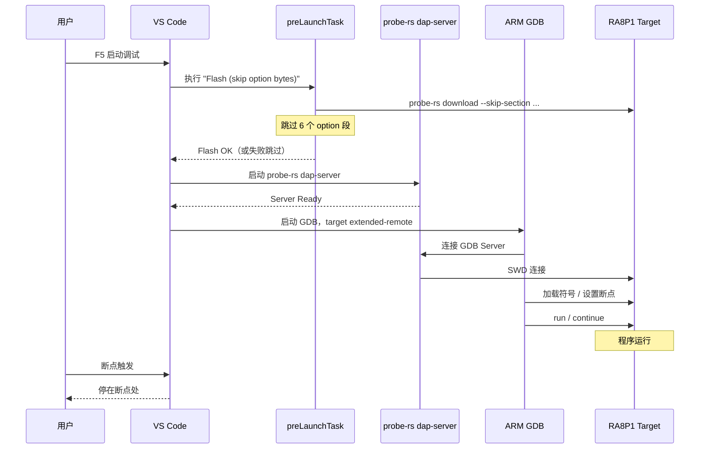
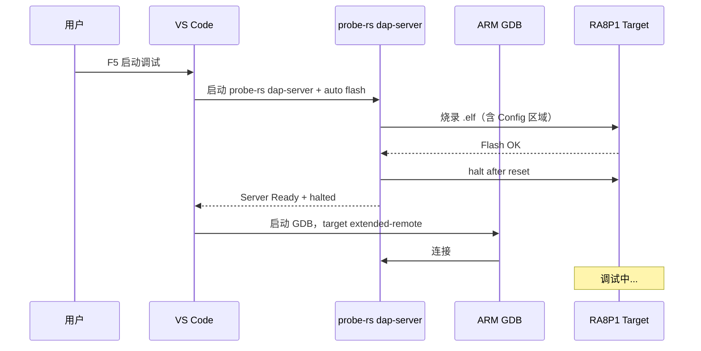
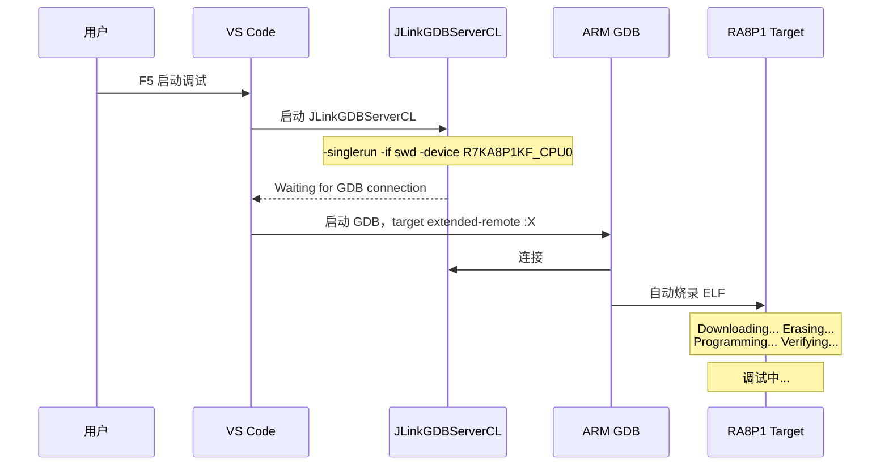
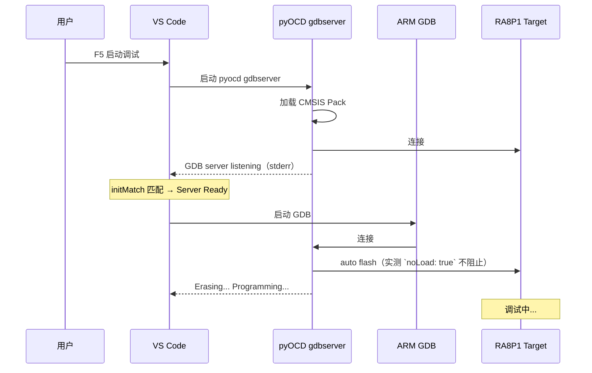

七、vscode四种调试方案完全指南
===
[toc]

# 一、项目概述

| 属性 | 说明 |
| :--- | :--- |
| 硬件 | Renesas RA8P1，ARM Cortex-M85 2Ghz，rtthread titan board |
| 工具链 | Arm GNU Toolchain 13.3.Rel1 (`D:\Program Files\GCC\arm-gnu-toolchain-13.3.rel1-mingw-w64-i686-arm-none-eabi\bin`) |
|构建|RASC-CMake|
|IDE|vscode|
| 调试扩展 | `probe-rs-debug` + `cortex-debug` 1.12.1 |


# 二、项目目录架构

<pre>ra8p1_titan_rtt_CM/
├── src/                  # 用户代码（hal_entry.c, log.c, syscall.c ...）
├── ra/                   # Renesas FSP HAL 驱动（arm/ + fsp/）
├── ra_gen/               # RASC 生成代码（hal_data, pin_data, vector_data, main）
├── ra_cfg/               # FSP 配置头文件（fsp_cfg/）
├── cmake/                # CMake 构建脚本（gcc.cmake, GeneratedSrc.cmake ...）
├── script/               # 辅助脚本
├── build/                # 构建输出目录
├── .vscode/              # VS Code 调试与构建配置
│   ├── <span style="color:#e06c75;font-weight:bold">launch.json       # 核心修改文件：4 个调试配置入口</span>
│   ├── <span style="color:#e06c75;font-weight:bold">tasks.json        # 核心修改文件：构建与烧录 Task 定义</span>
│   ├── settings.json     # 原始文件：工作区默认设置
│   ├── <span style="color:#e06c75;font-weight:bold">c_cpp_properties.json  # 核心修改文件：IntelliSense 路径</span>
│   ├── cmake-kits.json   # 原始文件：CMake Kit 定义
│   ├── <span style="color:#61c264;font-weight:bold">pyocd_wrapper.py  # 新增文件：pyOCD stderr→stdout 包装器</span>
│   └── <span style="color:#61c264;font-weight:bold">pyocd_server.cmd  # 新增文件：pyOCD 批处理包装器</span>
├── CMakeLists.txt        # 顶层 CMake 构建定义
├── Config.cmake          # 工具链路径与编译标志
├── compile_commands.json # CMake 生成的编译命令索引（供 clangd / IntelliSense 使用）
├── <span style="color:#e06c75;font-weight:bold">flash.cmd             # 核心修改文件：probe-rs 烧录脚本（跳过 Option Bytes）</span>
├── DEBUGGUIDE.md         # 本调试指南
└── README.md             # 原工程说明</pre>

**构建流程**：CMake + MinGW Makefiles → Arm GNU Toolchain (arm-none-eabi-gcc) → `.elf`

**构建命令**：

```batch
:: 配置（首次 / 修改 CMakeLists.txt 后）
cmake -G "MinGW Makefiles" -S . -B build\Debug -DCMAKE_BUILD_TYPE=Debug

:: 编译
cmake --build build\Debug -j

:: 清理
cmake --build build\Debug --target clean

:: 全清（删除构建目录重新配置）
rmdir /s /q build\Debug
cmake -G "MinGW Makefiles" -S . -B build\Debug -DCMAKE_BUILD_TYPE=Debug

:: 一步到位：配置 + 编译（VS Code Task "Configure Project" + "Build Project"）
```

**调试架构**：四种方案共用同一 `.elf`，区别在于 GDB Server（probe-rs dap-server / JLinkGDBServerCL / pyOCD gdbserver）和 Option Bytes 处理策略。

**F5 行为说明**：

| 方案 | F5下载？ | 下载机制 | 日志显示在哪？ |
| :--- | :--- | :--- | :--- |
| **skip OFS** | ✅ **是** | preLaunchTask → `flash.cmd`（probe-rs download + `--skip-section`） | **终端 (Terminal)** 面板，Task 输出 |
| **write OFS** | ✅ **是** | `flashingEnabled: true`，probe-rs 自动烧录 | probe-rs 输出（Debug Console / 终端） |
| **Cortex JLink** | ✅ **是** | GDB 启动后将 ELF 传给 JLinkGDBServerCL，JLink 自动擦除+烧录+校验 | **Debug Console**（见实测日志 `Downloading... Erasing... Programming... Verifying...`） |
| **Cortex pyOCD** | ✅ **是** | GDB 启动后将 ELF 传给 pyOCD gdbserver，pyOCD 自动烧录（`noLoad: true` **不阻止**此过程） | **Debug Console**（见实测日志 `Erasing... Programming...`） |

所有方案 F5 都会自动下载固件到芯片，区别在于下载机制和 Option Bytes 处理策略。

**FSP 配置**：通过 RASC (RA Smart Configurator) 修改 `configuration.xml`，重新生成 `ra_gen/` 和 `cmake/`。


# 三、四种调试方案对比

| 特性 | 方案 A: probe-rs (skip OFS) | 方案 B: probe-rs (write OFS) | 方案 C: Cortex JLink | 方案 D: Cortex pyOCD |
| :--- | :--- | :--- | :--- | :--- |
| **调试器** | **JLink / DAPLink** | **JLink / DAPLink** | **JLink 仅** | **DAPLink 仅** |
| **Option Bytes** | **跳过**（参考 e2studio，见下方说明） | **写入**（YAML Config 改为 Nvm） | **写入**（JLink 无 YAML 检查，GDB 发什么写什么） | **写入**（pyOCD 无 YAML 检查，GDB 发什么写什么） |
| **烧录方式** | **F5 自动**: preLaunchTask → `flash.cmd` | **F5 自动**: `flashingEnabled: true` | **F5 自动**: GDB → JLinkGDBServerCL 自动烧录 | **F5 自动**: GDB → pyOCD gdbserver 自动烧录（`noLoad` 无效） |
| **推荐场景** | **日常开发 ★★★** | **首次烧录新板** | JLink 用户 | DAPLink 备用 |

> **Option Bytes 跳过原理**：
>
> probe-rs 的芯片描述 **YAML** 定义了 Flash Config 区域，而 GNU LD 链接脚本也定义同名段（`__option_setting_ofs*`）。两者设计角度不同：LD 负责在 ELF 中生成 OFS 内容，YAML 告诉 probe-rs 如何烧录这些段。e2studio 的调试器（如 Renesas Flash Programmer）默认**不擦除 Config 区域**，保留 RASC 一次性写入的值。
>
> 关键区别在于 **probe-rs 的 YAML 软件访问控制**：默认 YAML 将 Config 标记为 `!ReadOnly`，probe-rs 在软件层面检查到这个标记就**拒绝写入**，直接报错。JLink 和 pyOCD 没有这个 YAML 检查层，收到 GDB 发来的地址就直接写，所以不报错、不跳过。
>
> 因此四种方案的实际行为：
>
> | 方案 | 是否写 OFS？ | 不报错原因 |
> | :--- | :--- | :--- |
> | **A (skip OFS)** | **不写**（`--skip-section` 显式跳过） | 不写当然不报错 |
> | **B (write OFS)** | **写**（YAML 改为 `!Nvm`，解除限制） | YAML 允许写入 |
> | **C (JLink)** | **写** | 无 YAML 检查层 |
> | **D (pyOCD)** | **写** | 无 YAML 检查层 |
>
> JLink/pyOCD 的行为等价于 probe-rs 方案 B（write OFS），每次 F5 都写入 OFS。因为 RASC 生成的 OFS 值是正确的，所以不会出问题。但若 OFS 配置不当（如安全位被覆盖），风险是一样的。**方案 A（skip OFS）是唯一彻底不碰 Config 区域的方案，这就是它作为默认推荐的原因。**


# 三、方案 A — probe-rs (skip OFS)

**概述**：推荐日常使用。probe-rs 内置 dap-server 作为 GDB Server，flashingEnabled: false 将烧录委托给 preLaunchTask（flash.cmd），通过 --skip-section 跳过 6 个 Option Bytes 段。

**架构流程**：



**配置关键点**：

```jsonc
{
    "type": "probe-rs-debug",
    "chip": "R7KA8P1KF",
    "chipDescriptionPath": "...\\RA8P1_Series.yaml",    // 必须用原始（只读）YAML
    "runtimeExecutable": "...\\probe-rs.exe",
    "runtimeArgs": ["dap-server"],
    "flashingConfig": {
        "flashingEnabled": false                         // 烧录由 preLaunchTask 完成
    },
    "preLaunchTask": "Flash (skip option bytes)"
}
```

核心要点：
- **`chipDescriptionPath`** → 必须用 **`RA8P1_Series.yaml`**（Config 区域 `!ReadOnly`），不可用 `_writable.yaml`
- **`flashingEnabled: false`** → 烧录由 `flash.cmd` 独立完成
- **`flash.cmd`** → 设计为"失败则跳过"，不影响调试流程

**YAML 文件差异**：

| 文件 | Config 区域 | 用途 |
| :--- | :--- | :--- |
| **`RA8P1_Series.yaml`** | `!ReadOnly`，probe-rs 不会写入 | **方案 A（skip OFS）** |
| **`RA8P1_Series_writable.yaml`** | `!Nvm`，probe-rs 可以写入 | **方案 B（write OFS）** |

# 四、方案 B — probe-rs (write OFS)

**概述**：首次烧录新板或需要修改 Option Bytes 时使用。probe-rs 自动完成烧录（含 Config 区域），无需 preLaunchTask。

**架构流程**：



**配置关键点**：

```jsonc
{
    "type": "probe-rs-debug",
    "chip": "R7KA8P1KF",
    "chipDescriptionPath": "...\\RA8P1_Series_writable.yaml",  // 必须用可写 YAML
    "runtimeExecutable": "...\\probe-rs.exe",
    "runtimeArgs": ["dap-server"],
    "flashingConfig": {
        "flashingEnabled": true,
        "haltAfterReset": true
    }
}
```

核心要点：
- **`chipDescriptionPath`** → 必须用 **`RA8P1_Series_writable.yaml`**（Config `!Nvm`）
- **`flashingEnabled: true`** → probe-rs 自动烧录（含 Option Bytes）
- 首次烧录新板时推荐

# 五、方案 C — Cortex Debug (JLink)

**概述**：传统 cortex-debug + JLink GDB Server 方案，调试速度快、功能成熟。

**架构流程**：



**配置关键点**：

```jsonc
{
    "name": "Cortex Debug (JLink)",
    "type": "cortex-debug",
    "servertype": "jlink",
    "interface": "swd",
    "device": "R7KA8P1KF_CPU0",      // 必须带 _CPU0 后缀
    "runToEntryPoint": "main"
}
```

核心要点：
- **`device: "R7KA8P1KF_CPU0"`** → 必须带 **`_CPU0`** 后缀（JLink GDB Server 要求）
- F5 时 GDB 自动将 ELF 传给 JLinkGDBServerCL 完成烧录（+校验），日志见 Debug Console
- JLink **无 YAML 检查**，会写入 Option Bytes（等价于 probe-rs 方案 B）
- 无需 `chipDescriptionPath`

# 六、方案 D — Cortex Debug (pyOCD)

**概述**：cortex-debug + pyOCD GDB Server，适配 DAPLink。pyOCD 从 CMSIS Pack 读取芯片信息，无需 YAML 描述文件。

**注意**：实测 `noLoad: true` **不阻止** pyOCD gdbserver 烧录。F5 时 GDB 会将 ELF 传给 pyOCD，pyOCD 自动完成擦除+编程（见 Debug Console 日志 `Erasing... Programming...`）。但 `noLoad` 可能影响 cortex-debug 是否发送 GDB `load` 命令，不同版本行为可能不同。如需真正跳过烧录（保护 Option Bytes），建议改用方案 A（skip OFS）。

**架构流程**：



**配置关键点**：

```jsonc
{
    "name": "Cortex Debug (pyOCD)",
    "type": "cortex-debug",
    "servertype": "pyocd",
    "serverpath": "D:\\Program Files\\Python313\\Scripts\\pyocd.exe",
    "device": "R7KA8P1KF",              // 不带 _CPU0
    "targetId": "R7KA8P1KF",            // 传给 --target
    "cmsisPack": "D:\\Program Files\\pyocd\\packs\\Renesas.RA_DFP.6.1.0.pack",
    "noLoad": true                       // 仅调试不烧录（实测无效，pyOCD 仍会烧录）
}
```

核心要点：
- **`device`** / **`targetId`** → 用 **`R7KA8P1KF`**（不带 `_CPU0`）
- **`cmsisPack`** → 指向本地 `.pack`，pyOCD 自动转为 `--pack <path>`
- pyOCD **无 YAML 检查**，会写入 Option Bytes（等价于 probe-rs 方案 B）
- **`noLoad: true`** → 实测无法阻止 pyOCD 烧录，若要保护 Option Bytes 请用方案 A

**cortex-debug 补丁说明**：

cortex-debug 1.12.1 的 `PyOCDServerController.initMatch` 硬编码为正则 `/GDB server started (at|on) port/`，但 pyOCD 0.44.1 实际输出 `GDB server **listening** on port 50000`（输出到 stderr）。已手动补丁：

```diff
- initMatch(){return/GDB server started (at|on) port/}
+ initMatch(){return/GDB server (started (at|on) port|listening on port)/}
```

补丁位置：`%USERPROFILE%\.vscode\extensions\marus25.cortex-debug-1.12.1\dist\debugadapter.js`

该补丁在更新 cortex-debug 扩展后需重新应用。

备用方案（补丁丢失时）：
- 使用 `.vscode\pyocd_server.cmd`（批处理包装器，添加 `--pack` 参数）

# 七、烧录命令详解(附加)

## probe-rs 烧录

方案 A（跳过 Option Bytes，封装在 `flash.cmd`）：

```batch
probe-rs download ^
  --chip R7KA8P1KF ^
  --chip-description-path "D:\Program Files\probe-rs-tools-x86_64-pc-windows-msvc\renesas_ra\RA8P1_Series.yaml" ^
  --protocol swd --speed 1000 --allow-erase-all ^
  --skip-section "__option_setting_ofs0_reg$$" ^
  --skip-section "__option_setting_ofs2_reg$$" ^
  --skip-section "__option_setting_ofs1_sec_reg$$" ^
  --skip-section "__option_setting_ofs1_sel_reg$$" ^
  --skip-section "__option_setting_ofs3_sec_reg$$" ^
  --skip-section "__option_setting_ofs3_sel_reg$$" ^
  build\Debug\ra8p1_titan_rtt_CM.elf
```

要点：**`RA8P1_Series.yaml`**（只读）+ **6 个 `--skip-section`**

6 个 Option Bytes 段：

| 段落名称 | 对应寄存器 |
| :--- | :--- |
| `__option_setting_ofs0_reg$$` | OFS0 |
| `__option_setting_ofs2_reg$$` | OFS2 |
| `__option_setting_ofs1_sec_reg$$` | OFS1 Security |
| `__option_setting_ofs1_sel_reg$$` | OFS1 Select |
| `__option_setting_ofs3_sec_reg$$` | OFS3 Security |
| `__option_setting_ofs3_sel_reg$$` | OFS3 Select |

方案 B（写入 Option Bytes）：

```batch
probe-rs download ^
  --chip R7KA8P1KF ^
  --chip-description-path "D:\Program Files\probe-rs-tools-x86_64-pc-windows-msvc\renesas_ra\RA8P1_Series_writable.yaml" ^
  --protocol swd --speed 1000 --allow-erase-all ^
  build\Debug\ra8p1_titan_rtt_CM.elf
```

要点：**`RA8P1_Series_writable.yaml`**（可写） + **无 `--skip-section`**（烧录完整 Flash 含 Config）

其他命令：

```batch
:: 仅擦除
probe-rs erase --chip R7KA8P1KF --chip-description-path RA8P1_Series.yaml --protocol swd --allow-erase-all
:: 列出调试器
probe-rs list
```

## pyOCD 烧录

```batch
pyocd flash ^
  --target R7KA8P1KF ^
  --pack "D:\Program Files\pyocd\packs\Renesas.RA_DFP.6.1.0.pack" ^
  --frequency 1000000 --erase auto ^
  build\Debug\ra8p1_titan_rtt_CM.elf
```

注意事项：
- pyOCD 0.44.1 可能尝试烧录 Option Bytes，Config 区域写保护时失败，可使用 `--skip` 跳过
- `--pack` 指定本地 Pack，避免从网络下载（国内约 1760 个描述符易超时；`launch.json` 中 `cmsisPack` 已等效于 `--pack`）

## JLink 烧录

```batch
"C:\Program Files\SEGGER\JLink_V858\JLinkExe.exe" -device R7KA8P1KF -if SWD -speed 1000 -autoconnect 1 -CommanderScript flash.jlink
```

交互式：

```batch
"C:\Program Files\SEGGER\JLink_V858\JLinkExe.exe"
  > device R7KA8P1KF
  > if SWD
  > speed 1000
  > loadfile build\Debug\ra8p1_titan_rtt_CM.elf
  > r
  > g
  > exit
```

## 烧录方式汇总

| 烧录方式 | 命令 | 跳过 OFS | 速度 | 适用调试方案 |
| :--- | :--- | :--- | :--- | :--- |
| probe-rs download (skip) | **`flash.cmd`** | **是** | **快** | **方案 A (skip OFS)** |
| probe-rs download (all) | 命令行 | 否 | 快 | **方案 B (write OFS)** |
| pyOCD flash (CLI) | `pyocd flash ...` | 需 `--skip` | 中 | pyOCD 手动烧录 |
| pyOCD debug (F5) | cortex-debug + `noLoad: true` | **会烧录**（实测 `noLoad` 无效） | — | pyOCD F5 调试时会自动烧录 |
| JLinkExe | `JLinkExe ...` | N/A | 快 | 方案 C (JLink) |

# 八、故障排除

| 问题 | 原因 | 解决 |
| :--- | :--- | :--- |
| **probe-rs timeout** | 调试器被前一会话占用 | 断开 USB 重连，重启 VS Code |
| **flash.cmd failed** | probe-rs 忙或 YAML 路径错误 | 检查 **`chipDescriptionPath`** 和调试器连接 |
| **The chip description does not contain "Config"** | YAML 文件错误 | 确认使用**正确的 YAML**（只读 vs 可写） |
| **pyOCD Timeout (no match)** | initMatch 不匹配 | 检查**补丁**，或使用 wrapper |
| **pyOCD FlashAlgoException** | pyOCD 版本过旧 | 使用 pip 安装的 **0.44.1+** |
| **pyOCD pack index download timeout** | 国内网络慢 | 使用 **`cmsisPack`** 直接指定本地 .pack 文件 |
| **JLink Could not connect** | 驱动未安装或 USB 异常 | 重新安装 JLink 驱动 |
| **JLink Unknown device** | 名称错误 | 确认 **`_CPU0`** 后缀 |
| **断点不触发** | 调试器未 halt | 检查 **`haltAfterReset`** 或手动 monitor halt |
| **ELF 文件找不到** | 未编译 | 先执行 CMake Build |

# 九、参考资料

| 工具 / 资料 | 链接 / 说明 |
| :--- | :--- |
| **probe-rs** | [https://github.com/probe-rs/probe-rs](https://github.com/probe-rs/probe-rs) — 嵌入式调试工具，内置 GDB server |
| **probe-rs 文档 (Flash)** | [https://probe.rs/docs/tools/flash/](https://probe.rs/docs/tools/flash/) |
| **pyOCD** | [https://github.com/pyocd/pyOCD](https://github.com/pyocd/pyOCD) — CMSIS-DAP 调试器 |
| **pyOCD 文档** | [https://pyocd.io/docs/](https://pyocd.io/docs/) |
| **cortex-debug** | [https://github.com/Marus/cortex-debug](https://github.com/Marus/cortex-debug) — VS Code 扩展 |
| **JLink (SEGGER)** | [https://www.segger.com/products/debug-probes/j-link/](https://www.segger.com/products/debug-probes/j-link/) |
| **Renesas RA DFP Pack** | `Renesas.RA_DFP.6.1.0.pack` — 本地路径 `D:\Program Files\pyocd\packs\` |
| **Arm GNU Toolchain** | [Arm GNU Toolchain 13.3.Rel1](https://developer.arm.com/downloads/-/arm-gnu-toolchain-downloads) |
| **RA8P1 (R7KA8P1KF) 数据手册** | Renesas 官网文档 |
| **RT-Thread Titan Board** | [GitHub SDK BSP](https://github.com/RT-Thread-Studio/sdk-bsp-ra8p1-titan-board) / [RT-Thread 主线 BSP](https://github.com/RT-Thread/rt-thread/tree/master/bsp/renesas/ra8p1-titan-board) — 本工程使用的 RA8P1 测试开发板 |

# 十、总结

| 优先级 | 方案 | 调试器 | 场景 | 核心要点 |
| :--- | :--- | :--- | :--- | :--- |
| **★★★** | **probe-rs (skip OFS)** | JLink / DAPLink | **日常调试** | **只读 YAML + flash.cmd + 6 个 --skip-section** |
| **★★☆** | **probe-rs (write OFS)** | JLink / DAPLink | **首次烧录 / 改 OFS** | **可写 YAML + flashingEnabled: true** |
| **★★☆** | **Cortex JLink** | JLink 仅 | 传统调试 | **device 加 _CPU0** |
| **★☆☆** | **Cortex pyOCD** | DAPLink 仅 | DAPLink 备用 | **cmsisPack + noLoad（实测无效，仍会烧录）** |

**工具链**：Arm GNU Toolchain 13.3.Rel1 @ `D:\Program Files\GCC\arm-gnu-toolchain-13.3.rel1-mingw-w64-i686-arm-none-eabi\bin`（通过 `ARM_GCC_TOOLCHAIN_PATH` 指定；旧 README 示例的 `C:\12_2_mpacbti_rel1\bin` 本机未安装）