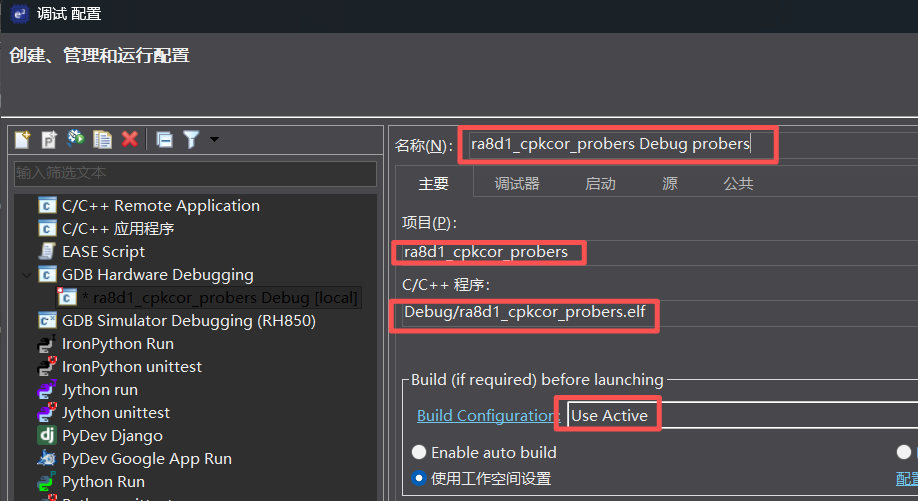
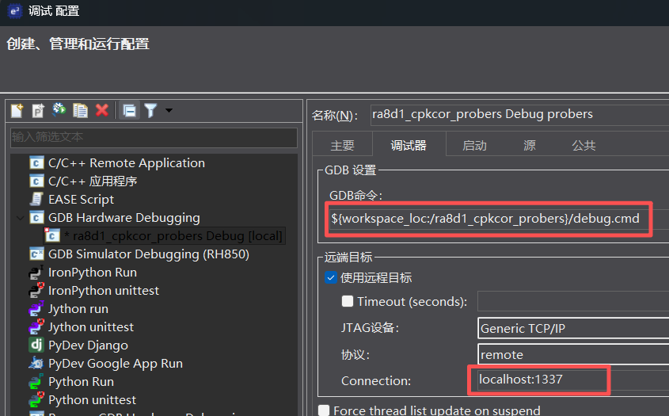
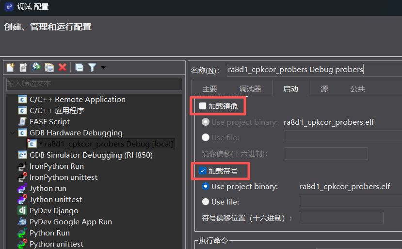

八、e2studio使用probe-rs下载+调试(一键方案)
===

[toc]

# 一、背景

- 上一节介绍了使用 VSCode Cortex-Debug 和 probe-rs 调试 RA 项目。本节介绍如何将 probe-rs **直接嵌入 e2studio**，实现 e2studio 内一键下载+调试，停止后芯片自动复位运行。

- probe-rs 优势：**不依赖 SEGGER 软件**，但需要简单配置且下载速度略慢。
- 我们最后形成**脚本debug.cmd，方便移植调用**，进一步降低使用门槛。

# 二、方案概述

| 步骤 | 内容 | 工具 |
|------|------|------|
| 第 1 步 | 安装 probe-rs + 切换 WinUSB 驱动 | PowerShell / SEGGER Configuration |
| 第 2 步 | 复制 debug.cmd 到项目根目录 | 文件管理器 |
| 第 3 步 | 修改 debug.cmd 中的项目参数 | 文本编辑器 |
| 第 4 步 | 新建 e2studio 调试配置指向 debug.cmd | e2studio |

# 三、安装 probe-rs

```powershell
winget install probe-rs
```

确认安装：

```powershell
probe-rs --version
```

J-Link 需要 WinUSB 驱动（使用 **SEGGER J-Link Configuration** → USB → 选中 J-Link → 改为 WinUSB）。如需恢复原生 J-Link 调试，切回 SEGGER 驱动即可。


# 四、核心：debug.cmd 脚本

核心是一个 **debug.cmd** 脚本文件，它替代了 e2studio 默认的 GDB 程序，自动完成下载 → 启动 GDB Server → 启动 GDB → 停止后复位。

## 4.1 复制到项目

将 `debug.cmd` 复制到你的项目根目录，按注释修改 4 个参数：

```cmd
set PROJ_DIR=E:\RS_workspace\ra8d1_cpkcor_probers   REM 项目路径
set GDB="D:\Program Files\GCC\...\arm-none-eabi-gdb.exe"  REM ARM GCC gdb路径
set CHIP=R7FA8D1BH   REM 芯片型号
set PRJ_NAME=ra8d1_cpkcor_probers   REM 项目名
```

## 4.2 脚本流程

```
taskkill → 清除残留进程
    │
    ▼
probe-rs download → 下载固件（弹出进度窗口）
    │
    ▼
probe-rs gdb → GDB Server 后台监听 1337 端口
    │
    ▼
arm-none-eabi-gdb → 调试开始
    │
    ▼
调试结束 → probe-rs reset 复位芯片继续运行
```

# 五、配置 e2studio 调试启动项

新建 GDB Hardware Debugging 配置，主要改 3 处：

## 5.1 主要标签页



项目名和配置名（建议以 `probers` 结尾）。

## 5.2 调试器标签页



- **GDB 命令**：`${workspace_loc:/ra8d1_cpkcor_probers}/debug.cmd`
- **连接**：TCP `localhost:1337`

## 5.3 启动标签页



- **加载镜像**：取消勾选（debug.cmd 已处理下载）
- **加载符号**：勾选（源码级调试）
- **初始化命令**：留空

# 六、开始调试

点击 Debug，自动弹出下载进度条 → 完成后进入调试器 → 停止调试后芯片自动复位运行。

# 七、优缺点对比

| | probe-rs | 原生 J-Link (JLinkGDBServerCL) |
|------|------|------|
| 依赖 | 无，仅需 probe-rs | 需安装 SEGGER 软件包 |
| 配置 | 复制脚本修改 4 个参数 | e2studio 自动生成 |
| 下载速度 | 略慢 | 快 |
| 停止后行为 | 自动复位运行 | MCU 保持暂停 |
| 下载进度条 | 有 | 无 |
| 驱动 | WinUSB | SEGGER |

# 八、常见问题

**Q：下载失败 "Failed to open probe"？**

A：J-Link 驱动是否已切换为 WinUSB？运行 `probe-rs list` 确认能识别到调试器。

**Q：停止调试后 MCU 还是暂停的？**

A：手动运行 `probe-rs reset --chip <型号>` 测试，确认 debug.cmd 末尾的 reset 命令正确执行。

**Q：想用回原生 J-Link 调试？**

A：驱动切回 SEGGER，调试配置改回默认 JLinkGDBServerCL 即可。
