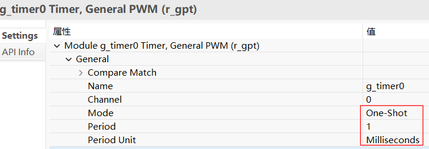
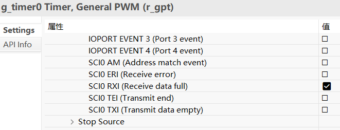
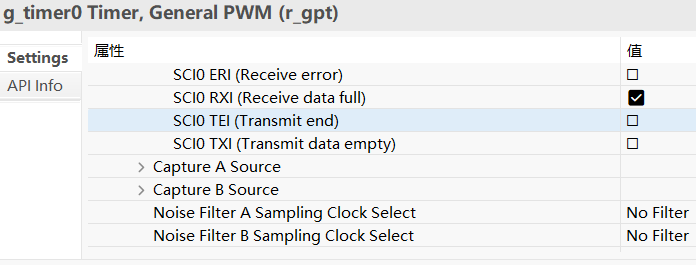
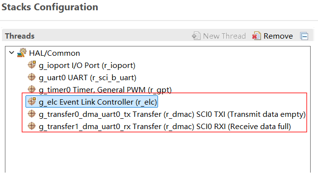
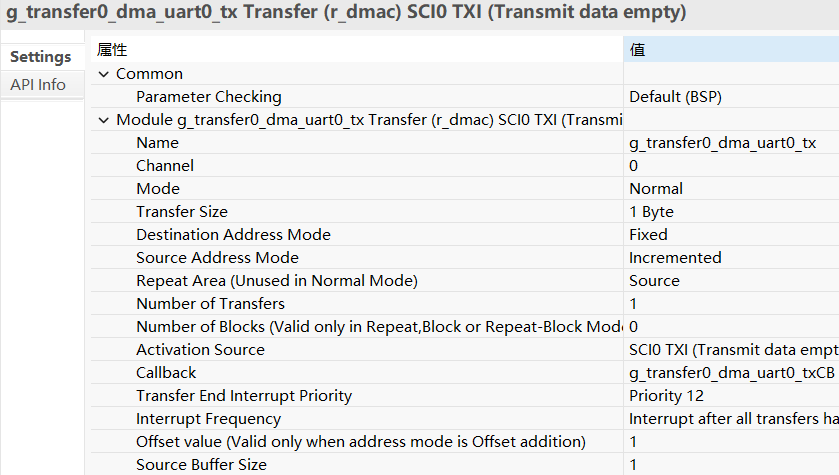
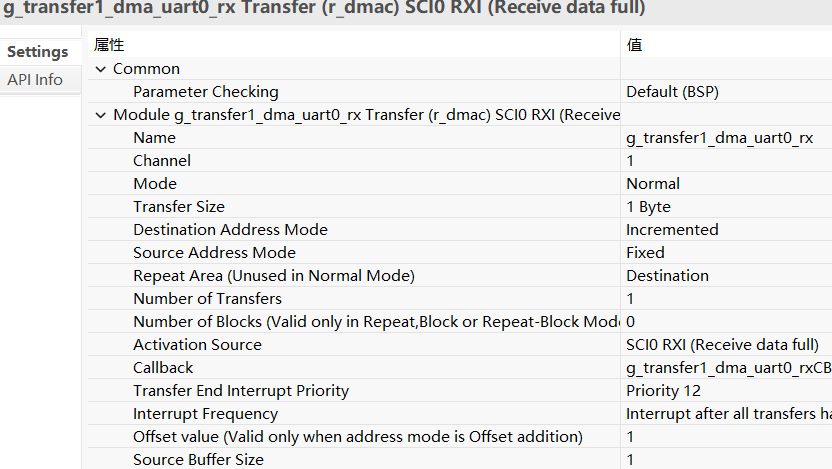
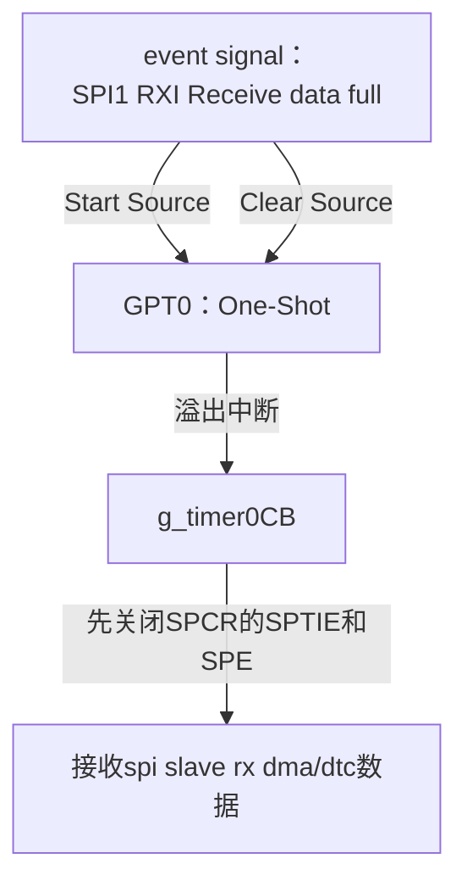
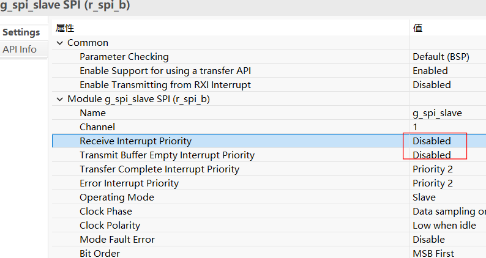
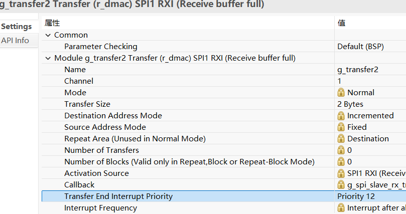
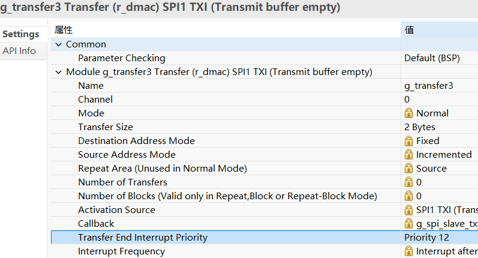

十二、RA8P1 SPI SLAVE DMA接收不定长
===
[toc]

# 一、概述
- [十一、从0开始卷出一个新项目之瑞萨RA6M5串口DMA接收不定长](https://mp.weixin.qq.com/s?__biz=MzkxNDQyMTU4Mg==&mid=2247485323&idx=1&sn=186d5310a5278e09916adde1e5c81097&chksm=c16fe5aaf6186cbc85d37bd69deeec93a80045fe80acfdbadaef983378973ac80499fae4b546&token=924418606&lang=zh_CN#rd)
- 上一篇文章讲了串口uart的dma接收不定长，本文讲spi slave的dtc/dma接收不定长
- 关键原理：都是通过gpt定时器和elc来硬件检测"空闲"，思路和stm32的空闲中断类似，但瑞萨没有现成的api，需要自己封装
- 但是：uart和spi本质上有区别：
    - uart是异步通信，全双工，接收方只要知道波特率就能收到任意长度的数据
    - spi是同步通信，伪全双工，spi master必须指定长度（时钟由master产生，slave无法决定）
    - 所以spi master发送不定长数据时，slave在"半双工使用场景"下（只收不发），就存在dtc/dma接收不定长的问题——这是本文重点讨论的
- 本文会先简单对比ra8x2 uart的dtc/dma接收不定长（和ra6m5基本一样），再重点讲spi slave的dtc/dma接收不定长


# 二、ra8x2 uart dtc/dma接收不定长（与ra6m5基本一样）
- ra8x2的uart接收不定长和ra6m5的实现思路基本一样，都是通过rx full事件经elc触发gpt单次定时，gpt溢出即认为空闲
- 但有一个微小差别：uart的ip不同，ra6m5是R_SCI，ra8x2是R_SCI_B（多一个B）
- R_SCI和R_SCI_B的寄存器名称有差异，比如使能接收/发送的控制寄存器，R_SCI是SCR，R_SCI_B是CCR0，配置步骤要对应改一下

## 2.1 ra8x2 uart dtc接收不定长

### 2.1.1 fsp配置







### 2.1.2 源码

```
void hal_entry(void)
{
    /* TODO: add your own code here */
    uint8_t test[] = "Test ra8p1 uart dtc recv volatile string\n";
    g_uart0.p_api->open(g_uart0.p_ctrl, g_uart0.p_cfg);
    R_SCI_B_UART_Write(g_uart0.p_ctrl, test, strlen(test));

    g_timer0.p_api->open(g_timer0.p_ctrl, g_timer0.p_cfg);
    g_timer0.p_api->enable(g_timer0.p_ctrl);
    //g_timer0.p_api->start(g_timer0.p_ctrl);

    g_elc.p_api->open(g_elc.p_ctrl, g_elc.p_cfg);
    g_elc.p_api->enable(g_elc.p_ctrl);

    R_SCI_B_UART_Read(g_uart0.p_ctrl, (uint8_t *)uart0_dtc_rx_data, RX_MAX);

    while(1)

}
void g_timer0CB(timer_callback_args_t *p_args)
{
    if(p_args->event == TIMER_EVENT_CYCLE_END)
    {
        transfer_properties_t p_properties;
        g_transfer1.p_api->infoGet(g_transfer1.p_ctrl, &p_properties);

        R_SCI_B_UART_Write(g_uart0.p_ctrl, (uint8_t *)(uart0_dtc_rx_data), RX_MAX - p_properties.transfer_length_remaining);

        R_SCI_B_UART_Read(g_uart0.p_ctrl, (uint8_t *)(uart0_dtc_rx_data), RX_MAX);
    }
}
```

## 2.2 ra8x2 uart dma接收不定长

### 2.2.1 fsp配置








### 2.2.2 dma api封装

```
fsp_err_t R_SCI_B_UART_Write_DMA (uart_ctrl_t * const p_api_ctrl, uint8_t const * const p_src, uint16_t const bytes)
{
    fsp_err_t err = FSP_SUCCESS;

    sci_b_uart_instance_ctrl_t * p_ctrl = (sci_b_uart_instance_ctrl_t *) p_api_ctrl;

    //Before initiating DMA transfer, must be clear it first.
    R_ICU->IELSR[SCI0_TXI_IRQn] = 0U;

    p_ctrl->p_reg->CCR0 &= (uint32_t) ~(R_SCI_B0_CCR0_TIE_Msk | R_SCI_B0_CCR0_TEIE_Msk);
    /* Disable transmission */
    p_ctrl->p_reg->CCR0 &= (uint32_t) ~(R_SCI_B0_CCR0_TE_Msk);

    //dma config
    g_transfer0_dma_uart0_tx.p_cfg->p_info->p_src = (void*)&p_src[0];
    g_transfer0_dma_uart0_tx.p_cfg->p_info->p_dest = (void*)&R_SCI_B0->TDR;
    g_transfer0_dma_uart0_tx.p_cfg->p_info->length = bytes;

    err = g_transfer0_dma_uart0_tx.p_api->reconfigure(g_transfer0_dma_uart0_tx.p_ctrl, g_transfer0_dma_uart0_tx.p_cfg->p_info);

    /* Set TE and TIE bits simultaneously by single instruction to enable TIE interrupt.
     * See "Serial Data Transmission in Asynchronous Mode" in the SCI section of the relevant
     * hardware manual. */
    p_ctrl->p_reg->CCR0 |= (uint32_t) (R_SCI_B0_CCR0_TE_Msk | R_SCI_B0_CCR0_TIE_Msk);

    return err;

}

fsp_err_t R_SCI_B_UART_Read_DMA (uart_ctrl_t * const p_api_ctrl, uint8_t const * const p_dest, uint16_t const bytes)
{
    fsp_err_t err = FSP_SUCCESS;

    sci_b_uart_instance_ctrl_t * p_ctrl = (sci_b_uart_instance_ctrl_t *) p_api_ctrl;

    //Before initiating DMA transfer, must be clear it first.
    R_ICU->IELSR[SCI0_RXI_IRQn] = 0U;

    p_ctrl->p_reg->CCR0 &= (uint32_t) ~(R_SCI_B0_CCR0_RE_Msk | R_SCI_B0_CCR0_RIE_Msk);

    //dma config
    g_transfer1_dma_uart0_rx.p_cfg->p_info->p_src = (void*)&R_SCI_B0->RDR;
    g_transfer1_dma_uart0_rx.p_cfg->p_info->p_dest = (void*)&p_dest[0];
    g_transfer1_dma_uart0_rx.p_cfg->p_info->length = bytes;

    err = g_transfer1_dma_uart0_rx.p_api->reconfigure(g_transfer1_dma_uart0_rx.p_ctrl, g_transfer1_dma_uart0_rx.p_cfg->p_info);

    p_ctrl->p_reg->CCR0 |= (uint32_t) (R_SCI_B0_CCR0_RE_Msk | R_SCI_B0_CCR0_RIE_Msk);

    return err;

}
```

### 2.2.3 源码

```
void hal_entry(void)
{
    /* TODO: add your own code here */
    uint8_t test0[] = "helloworld\n";
    g_uart0.p_api->open(g_uart0.p_ctrl, g_uart0.p_cfg);
    R_SCI_B_UART_Write(g_uart0.p_ctrl, test0, strlen(test0));
    R_BSP_SoftwareDelay(1, BSP_DELAY_UNITS_SECONDS);

    g_timer0.p_api->open(g_timer0.p_ctrl, g_timer0.p_cfg);
    g_timer0.p_api->enable(g_timer0.p_ctrl);
    //g_timer0.p_api->start(g_timer0.p_ctrl);

    g_elc.p_api->open(g_elc.p_ctrl, g_elc.p_cfg);
    g_elc.p_api->enable(g_elc.p_ctrl);

    g_transfer0_dma_uart0_tx.p_api->open(g_transfer0_dma_uart0_tx.p_ctrl, g_transfer0_dma_uart0_tx.p_cfg);
    g_transfer0_dma_uart0_tx.p_api->enable(g_transfer0_dma_uart0_tx.p_ctrl);

    g_transfer1_dma_uart0_rx.p_api->open(g_transfer1_dma_uart0_rx.p_ctrl, g_transfer1_dma_uart0_rx.p_cfg);
    g_transfer1_dma_uart0_rx.p_api->enable(g_transfer1_dma_uart0_rx.p_ctrl);

    uint8_t test1[] = "Test ra8p1 uart dma recv volatile string\n";
    R_SCI_B_UART_Write_DMA(g_uart0.p_ctrl, test1, strlen(test1));
    R_SCI_B_UART_Read_DMA(g_uart0.p_ctrl, uart0_dma_rx_data, RX_MAX);

    while(1)

}

void g_timer0CB(timer_callback_args_t *p_args)
{
    if(p_args->event == TIMER_EVENT_CYCLE_END)
    {
        transfer_properties_t p_info;

        R_DMAC_InfoGet(g_transfer1_dma_uart0_rx.p_ctrl, &p_info);

        R_SCI_B_UART_Write_DMA(g_uart0.p_ctrl, uart0_dma_rx_data, (uint16_t)(RX_MAX - p_info.transfer_length_remaining));


        R_SCI_B_UART_Read_DMA(g_uart0.p_ctrl, uart0_dma_rx_data, RX_MAX);
    }

}
```

# 三、ra8x2 spi slave dtc/dma接收不定长

## 3.1 与uart的本质区别

- uart接收不定长用的是rx full事件+elc+gpt，spi slave接收不定长的思路类似，但是有个本质区别：
    - spi是同步通信伪全双工，spi master必须指定长度，master发送多少长度，时钟就产生多少拍
    - spi slave半双工使用场景下（只收不发），slave不知道master会发多少数据，所以slave侧要用dtc/dma去"收满"一个最大长度（RX_MAX），再用gpt+elc检测spi空闲，空闲时统计实际收到多少
- 总结：接收传输数据开始前，要关闭spi的2个寄存器——SPCR寄存器里的SPTIE（SPI传输中断使能）和SPE（SPI使能）
- 为什么要关这2个寄存器？
    - 因为spi slave每次重新启动dtc/dma接收前，需要先把spi模块的传输中断和spi使能关掉，等dtc/dma重新配置好再开启，否则会出现接收错误（比如第一次接收后再次开启，数据错位/收不到）
- 框图：



## 3.2 spi slave dtc接收不定长

### 3.2.1 fsp配置


### 3.2.2 源码

```
void g_timer0CB(timer_callback_args_t *p_args)
{
    if(p_args->event == TIMER_EVENT_CYCLE_END)
    {

        g_slave_event_flag = SPI_EVENT_TRANSFER_COMPLETE;

        transfer_properties_t p_info;

        R_DTC_InfoGet(g_transfer2.p_ctrl, &p_info);

#if 1//spi slave recv volatile
#define R_SPI_B0_SPCR_SPTIE_Msk       (0x100000UL)   /*!< SPTIE (Bitfield-Mask: 0x01)                           */
#define R_SPI_B0_SPCR_SPE_Msk         (0x1UL)        /*!< SPE (Bitfield-Mask: 0x01)                             */
        g_spi_slave_ctrl.p_regs->SPCR &= ~(R_SPI_B0_SPCR_SPTIE_Msk | R_SPI_B0_SPCR_SPE_Msk);
        R_SPI_B_Read(&g_spi_slave_ctrl, g_slave_rx_buff, (uint32_t)(RX_MAX - p_info.transfer_length_remaining), SPI_BIT_WIDTH_32_BITS);
#endif

    }

}
```

### 3.2.3 日志

```
00> Press 1 for Write() and Read()
00> Press 2 for WriteRead()
00> Press 3 to Exit
  < 1
00> 
00> Enter text input for Master buffer. Data size should be less than 64 bytes.
  < 123123123123
00> 
00> Master transmitted user input data to Slave
00> 
00> Slave transmitted the data back to Master
00> 
00> Master received data: 123123123123 
00> 
00> ** SPI WRITE AND READ Demo Successful **
```

## 3.3 spi slave dma接收不定长

### 3.3.1 fsp配置








### 3.3.2 源码

```
void g_timer0CB(timer_callback_args_t *p_args)
{
    if(p_args->event == TIMER_EVENT_CYCLE_END)
    {

        g_slave_event_flag = SPI_EVENT_TRANSFER_COMPLETE;

        transfer_properties_t p_info;

        R_DTC_InfoGet(g_transfer2.p_ctrl, &p_info);

#if 1//spi slave recv volatile
#define R_SPI_B0_SPCR_SPTIE_Msk       (0x100000UL)   /*!< SPTIE (Bitfield-Mask: 0x01)                           */
#define R_SPI_B0_SPCR_SPE_Msk         (0x1UL)        /*!< SPE (Bitfield-Mask: 0x01)                             */
        g_spi_slave_ctrl.p_regs->SPCR &= ~(R_SPI_B0_SPCR_SPTIE_Msk | R_SPI_B0_SPCR_SPE_Msk);
        R_SPI_B_Read(&g_spi_slave_ctrl, g_slave_rx_buff, (uint32_t)(RX_MAX - p_info.transfer_length_remaining), SPI_BIT_WIDTH_32_BITS);
#endif

    }

}
```

### 3.3.3 日志

```
00> Press 1 for Write() and Read()
00> Press 2 for WriteRead()
00> Press 3 to Exit
  < 1
00> 
00> Enter text input for Master buffer. Data size should be less than 64 bytes.
  < 123123123123
00> 
00> Master transmitted user input data to Slave
00> 
00> Slave transmitted the data back to Master
00> 
00> Master received data: 123123123123 
00> 
00> ** SPI WRITE AND READ Demo Successful **
```

# 四、总结

| 对比项 | ra6m5 uart dtc/dma接收不定长 | ra8x2 uart dtc/dma接收不定长 | ra8x2 spi slave dtc/dma接收不定长 |
| --- | --- | --- | --- |
| 通信类型 | uart异步全双工 | uart异步全双工 | spi同步伪全双工 |
| 空闲检测 | rx full+elc+gpt | rx full+elc+gpt | spi rxi+elc+gpt |
| 是否指定长度 | 接收方不需指定 | 接收方不需指定 | master必须指定，slave半双工时收不定长 |
| uart/spi ip | R_SCI | R_SCI_B | SPI_B |
| 接收前处理 | dtc无需<br>dma清IELSR | dtc无需<br>dma清IELSR | dtc无需<br>dma关闭SPCR的SPTIE和SPE 2个寄存器 |
| 实际长度计算 | transfer_length_remaining | transfer_length_remaining | transfer_length_remaining |
| 需要封装api | dtc无需<br>dma需要（fsp无sci+dma api） | dtc无需<br>dma需要（fsp无sci_b+dma api） | 都需要（fsp无spi+dma/dtc api） |


- 下一篇预告：dtc和dma差别的深度分析
  - 本文中spi slave接收不定长，dtc和dma用起来"看起来一样"，只是fsp配置时选择transfer on dtc还是transfer on dma
  - 但它们本质差别很大：dma是直接寄存器配置，dtc是矢量表/描述符配置
  - 下一篇将更深入地对比dtc和dma的差别，比如：dtc占用cpu周期、dtc最大传输次数1024、dma独立于cpu、dtc一个矢量表项对应一个中断源等

