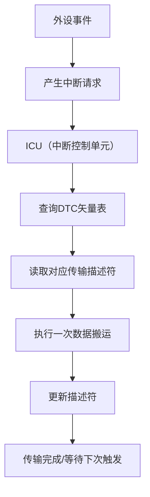
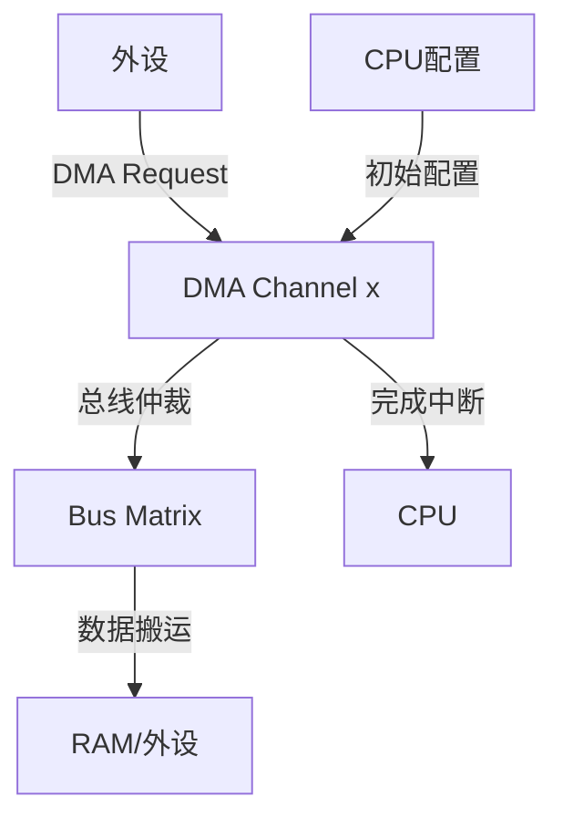

十三、RA8P1 DTC 与 DMAC 深度对比分析
===
[toc]

# 一、概述

- 前面的文章（十二、RA8P1 SPI SLAVE DMA接收不定长）对比了DTC和DMAC在SPI从机接收不定长数据时的应用。
- 本文作为其续篇，旨在从工程应用角度，深入剖析RA8P1系列MCU中DTC（Data Transfer Controller）和DMAC（Direct Memory Access Controller）的本质差异。
- **核心观点**：DTC和DMAC虽然都用于数据搬运，但设计哲学截然不同。理解这些差异，是正确选择和使用它们的关键。
- 本文将从**工作原理、硬件结构、并行能力、优先级管理、典型应用场景**五个维度进行对比，并附上工程实践中的选择建议与注意事项。

# 二、DTC（Data Transfer Controller）详解

## 2.1 工作原理与定位

DTC可以理解为"**事件驱动的智能数据搬运工**"。它直接与中断系统深度绑定，每个外设中断请求都可以被配置为DTC的触发源。

**工作流程：**

## 2.2 硬件结构特点

- **无固定通道**：DTC没有传统意义上的硬件通道（CH0~CHn）。它的"通道"本质上是**中断源**。
- **单执行引擎**：DTC内部只有一个数据搬运引擎。所有触发请求必须排队，依次处理。
- **基于描述符的配置**：每个中断源在RAM中对应一个传输描述符（Transfer Information），包含源地址、目标地址、传输计数等。DTC在触发时动态读取和更新这些描述符。

## 2.3 关键特性总结

| 特性 | 说明 |
|------|------|
| 触发方式 | 外设中断请求 |
| 通道概念 | 无固定通道，基于中断源 |
| 执行单元 | 单引擎，串行处理 |
| 配置存储 | RAM中的描述符表 |
| 最大传输次数（注） | 1024次（每次触发可配置传输1个或多个数据单元） |
| 典型负担 | 每次触发需查询矢量表、读取/更新描述符，有一定CPU/D总线开销 |

> **注**：DTC一个描述符链最大可配置1024次传输，但可通过链接描述符实现更长传输。

# 三、DMAC（Direct Memory Access Controller）详解

## 3.1 工作原理与定位

DMAC是"**独立于CPU的高速数据搬运协处理器**"。它拥有专用的硬件通道，能够响应外设的DMA请求（而非中断请求），在后台完成大数据块的连续搬运。

**工作流程：**

## 3.2 硬件结构特点

- **多独立通道**：RA8P1的DMAC通常包含多个硬件通道（如DMAC0 CH0~CH7，部分型号有DMAC1 CH0~CH7）。每个通道独立配置和控制。
- **高并行能力**：多个通道可以同时响应请求，由硬件仲裁器决定总线访问优先级。
- **寄存器配置**：传输参数（源/目标地址、长度等）直接配置在通道的硬件寄存器中，无需额外RAM访问开销。

## 3.3 关键特性总结

| 特性 | 说明 |
|------|------|
| 触发方式 | 外设DMA请求信号 |
| 通道概念 | 固定硬件通道（CH0~CHn） |
| 执行单元 | 多通道，可并行工作 |
| 配置存储 | 通道专用寄存器 |
| 最大传输次数 | 取决于寄存器位宽（通常高达65535或更多） |
| 典型优势 | 高吞吐、低CPU干预，适合连续流数据 |

# 四、深度对比分析

## 4.1 并行与响应能力

| 对比项 | DTC | DMAC |
|--------|-----|------|
| **处理方式** | **串行处理**：多个中断同时发生需排队处理 | **并行处理**：多通道可同时响应，硬件仲裁 |
| **响应速度** | 依赖CPU中断优先级和DTC查询周期 | 独立硬件，响应延迟低且确定 |
| **适用场景** | 多个、分散、非持续的小事件 | 少数、持续、大流量的数据通道 |

## 4.2 优先级管理

- **DTC**：优先级继承自触发它的**中断源优先级**，由ICU（中断控制单元）管理。高优先级中断触发的DTC传输优先执行。
- **DMAC**：每个通道有独立的**通道优先级**（如固定优先级、轮询优先级等），由DMAC内部仲裁器管理，与CPU中断系统无关。

## 4.3 资源配置与开销

- **DTC**：
    - **资源**：占用RAM空间存储描述符表。
    - **开销**：每次触发需要读取和更新描述符，产生额外的总线周期和CPU（或总线矩阵）负载。
- **DMAC**：
    - **资源**：占用硬件通道，数量有限（如8个或16个）。
    - **开销**：配置完成后，数据搬运过程几乎不占用CPU资源，仅消耗总线带宽。

## 4.4 工程实践关键差异

1.  **SPI从机接收不定长数据（参见上一篇文章）**：
    - 在代码中，无论是使用DTC还是DMAC，我们都需要在空闲超时后，调用`R_DTC_InfoGet`或`R_DMAC_InfoGet`来获取剩余传输长度，从而计算实际收到的字节数。
    - **关键操作**：重新启动接收前，**必须关闭SPI的使能（SPE）和传输中断使能（SPTIE）**，以防数据错位。这一操作与使用DTC或DMAC无关，是SPI外设本身的特性。

2.  **外设API封装**：
    - **UART使用DTC**：FSP提供了标准UART API（如`R_SCI_B_UART_Read`），内部可配置使用DTC，无需用户额外封装。
    - **UART使用DMAC**：FSP标准UART API**不直接支持DMAC**，需要用户自行封装`R_SCI_B_UART_Read_DMA`和`Write_DMA`，在函数内处理DMAC的重新配置和UART寄存器的控制（如清中断标志、开关接收使能等）。

# 五、工程应用选择指南

| 应用场景 | 推荐方案 | 原因 |
|----------|----------|------|
| **UART/SPI/I2C 小数据包收发** | **DTC** | 配置简单，响应灵活，适合事件驱动型小数据传输。 |
| **ADC 多通道连续采样** | **DMAC** | 高速、连续的数据流，DMAC高吞吐和低CPU占用优势明显。 |
| **音频/摄像头数据流** | **DMAC** | 大数据块传输，需要稳定带宽，DMAC是必然选择。 |
| **存储器到存储器的大数据拷贝** | **DMAC** | 释放CPU，利用DMAC完成高速内存复制。 |
| **多个低速外设同时通信** | **DTC**（若通道不足） | 当DMAC硬件通道不足时，DTC可作为有效的补充方案。 |

# 六、总结

| 对比项 | DTC (Data Transfer Controller) | DMAC (Direct Memory Access Controller) |
|--------|--------------------------------|-----------------------------------------|
| **本质** | 基于中断向量的智能搬运 | 独立的多通道DMA协处理器 |
| **触发源** | 外设中断请求 (Interrupt Request) | 外设DMA请求 (DMA Request) |
| **通道** | 无固定通道（基于中断源） | 固定硬件通道 (CH0~CHn) |
| **处理能力** | 单引擎，串行处理 | 多通道，并行处理 |
| **优先级** | 由中断优先级决定 | 由通道优先级决定 |
| **配置方式** | RAM中的描述符表 | 通道专用寄存器 |
| **典型优势** | 灵活、响应大量分散事件 | 高吞吐、连续大数据流搬运 |
| **一句话理解** | **一群外设事件通知一个智能搬运员，每次搬一点** | **几个专用硬件通道持续不断搬运大量数据** |

**最终决策要点：**

- **看事件**：事件多、数据小、不连续 → **DTC**
- **看流量**：数据流大、连续、高速 → **DMAC**
- **看资源**：DMAC通道不够用 → **DTC补位**
- **看外设**：FSP API是否原生支持（如UART+DTC原生，UART+DMAC需封装）

