十六、RA8T2双核Keil工程开发指南
===
[toc]

# 1. 背景
- 本文主要介绍 RA8T2  **双核Keil** 工程的 **断点调试**  功能。
- e2studio的双核功能按照AN操作，即可顺利调试，但keil双核默认无法调试，需要修改和操作技巧。

---

# 2. 目录结构
- 仅列出重要的文件和文件夹，这些文件功能和用法都需要理解

```
ra8t2_dual_keil/
│
├── ra8t2_dual_keil/                     ← 主工程（Workspace）
│   ├── ra8t2_dual_keil.uvmpw            ← 工作空间文件，管理 CPU0/CPU1 多个项目
│   ├── ra8t2_dual_keil.uvprojx          ← 项目工程文件（编译器、链接器配置）
│   ├── via/rasc_armclang.via             ← RASC 编译器参数文件
│   ├── solution.xml                      ← Solution 配置（clocks、pins、memorys、OFS）
│   └── build/
│       └── ra8t2_dual_keil.sbd          ← Smart Bundle（主工程配置数据）
│
├── ra8t2_dual_keil_CPU0/                ← CPU0 工程（Cortex-M85）
│   ├── ra8t2_dual_keil_CPU0.uvprojx     ← 项目工程文件
│   ├── via/rasc_armclang.via             ← RASC 编译器参数文件
│   ├── fsp_gen.scat                      ← FSP 生成的链接脚本
│   ├── configuration.xml                ← CPU0 配置（bsp、event links、stacks）
│   ├── debug.ini                        ← 调试脚本
│   └── Objects/
│       └── ra8t2_dual_keil_CPU0.sbd     ← Smart Bundle（CPU0 配置数据）
│
└── ra8t2_dual_keil_CPU1/                ← CPU1 工程（Cortex-M33）
    ├── ra8t2_dual_keil_CPU1.uvprojx     ← 项目工程文件
    ├── via/rasc_armclang.via             ← RASC 编译器参数文件
    ├── fsp_gen.scat                      ← FSP 生成的链接脚本
    ├── configuration.xml                ← CPU1 配置（bsp、event links、stacks）
    ├── debug.ini                        ← 调试脚本
    └── Objects/
        └── ra8t2_dual_keil_CPU1.sbd     ← Smart Bundle（CPU1 配置数据）
```

---

## 2.1 关键文件说明

### 2.1.1 工程文件

| 文件 | 功能 |
|------|------|
| `.uvmpw` | Keil 工作空间文件，管理 CPU0/CPU1 多个项目 |
| `.uvprojx` | 单项目工程文件（编译器、链接器配置） |
| `via/rasc_armclang.via` | RASC 生成的编译器参数文件 |
| `fsp_gen.scat` | FSP 生成的链接脚本 |

### 2.1.2 XML 配置文件

| 文件 | 位置 | 功能 |
|------|------|------|
| `solution.xml` | 主工程 | 管理 clocks、pins、memorys、OFS（芯片级公共配置） |
| `configuration.xml` | CPU0 | 管理 CPU0 的 bsp、event links、stacks |
| `configuration.xml` | CPU1 | 管理 CPU1 的 bsp、event links、stacks |

### 2.1.3 调试与配置文件

| 文件 | 功能 |
|------|------|
| `debug.ini` | 调试器初始化脚本（加载符号、hex） |
| `*.sbd` | Smart Bundle，包含 FSP 配置器生成的多核配置数据 |

---

# 3. RASC创建双核Keil工程

## 步骤 1：创建 Solution

1. 打开 RASC（FSP Smart Configurator）
2. 选择 **File → New → FSP Solution**

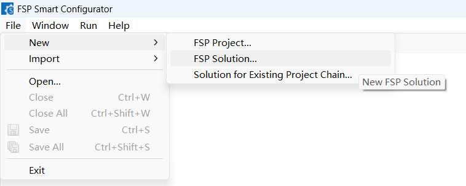

## 步骤 2：命名 Solution

1. 输入 Solution 名称（如 `ra8t2_dual_led_keil`）
2. 选择存储位置
3. 点击 **Next**

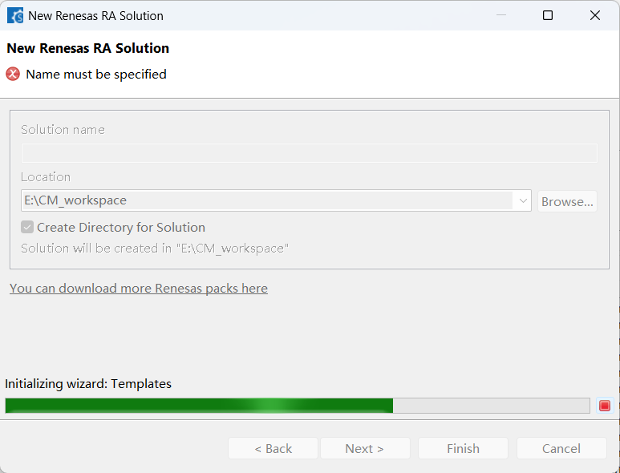

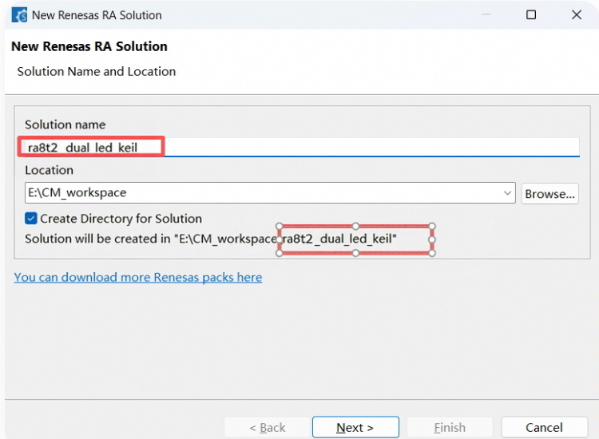

## 步骤 3：选择芯片和模板

1. **Board**: 选择 `EK-RA8T2`（或 `MCK-RA8T2`）
2. **Device**: 选择 `R7KA8T2LFECAC`
3. **Solution Template**: 选择 `Bare Metal → Blinky`
4. **IDE Project Type**: 选择 `Keil MDK Version 5`
5. **Toolchains**: 选择 `ARM Compiler 6`
6. 点击 **Finish**

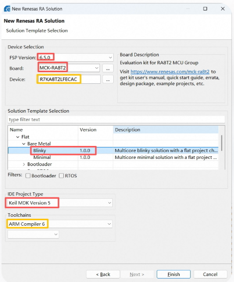

## 步骤 4：等待生成

RASC 自动生成 CPU0 和 CPU1 工程，等待完成。

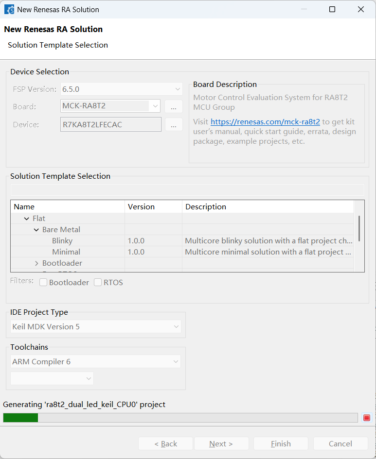

## 步骤 5：查看 Solution 配置

生成完成后，显示 Solution 配置界面：
- **Board**: EK-RA8T2
- **Device**: R7KA8T2LFECAC
- **C/C++ Projects**: CPU0 和 CPU1 工程

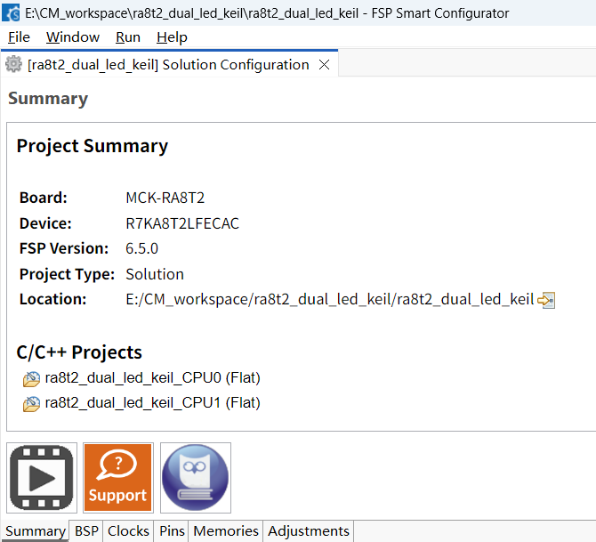

## 步骤 6：查看生成的工程文件

生成完成后，可以在 Windows 资源管理器中查看生成的工程目录结构，包括 `build`、`via`、`.secure_xml`、`buildinfo.gpdsc` 以及 Keil 项目文件（`.uvprojx`）等。

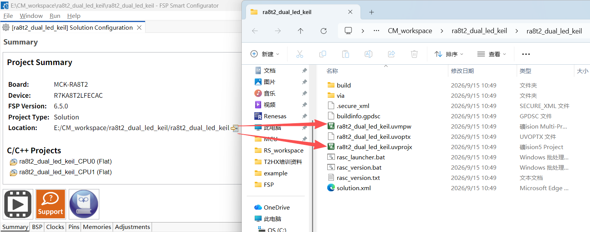

## 步骤 7：打开 CPU0 FSP 配置

1. 在 Solution 配置界面中，点击 **CPU0** FSP Configuration 选项卡
2. 查看 CPU0 的 Flat Project 配置（Core: CPU0，Smart Bundle: `ra8t2_dual_led_keil.sbd`）

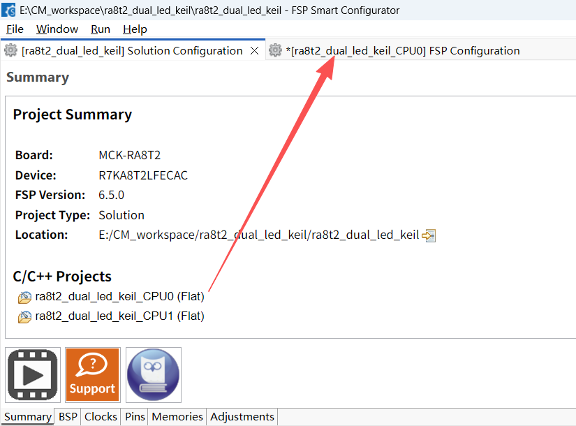

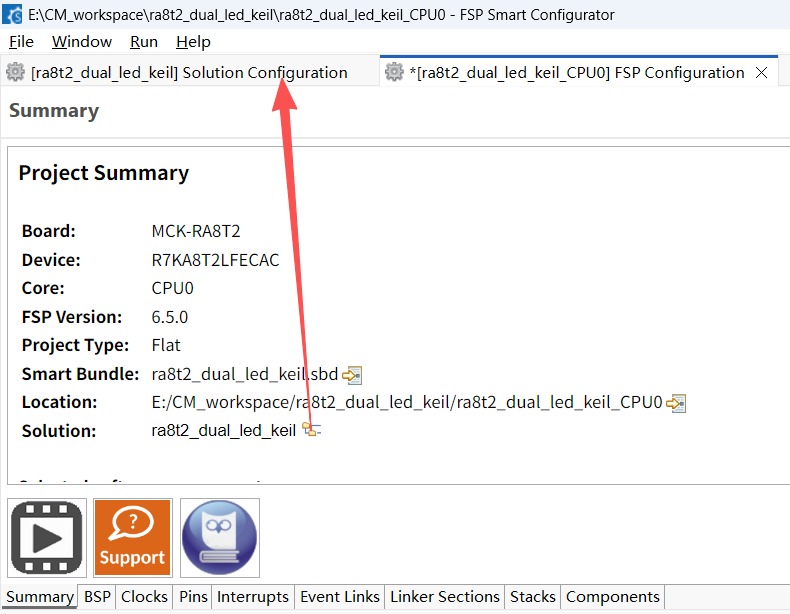

查看 CPU0 工程文件夹，包含 `configuration.xml`、`debug.ini`、`fsp_gen.scat`、`memory_regions.scat` 以及 Keil 项目文件。

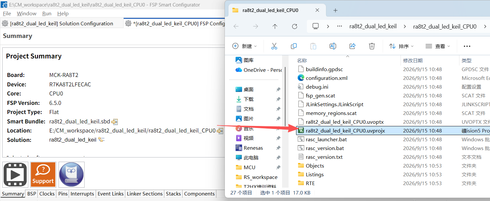

---

# 4. CPU0下载与断点调试

## 步骤 1：编译工程

1. **编译主工程**：打开主工程 `.uvprojx`，点击 **Rebuild**

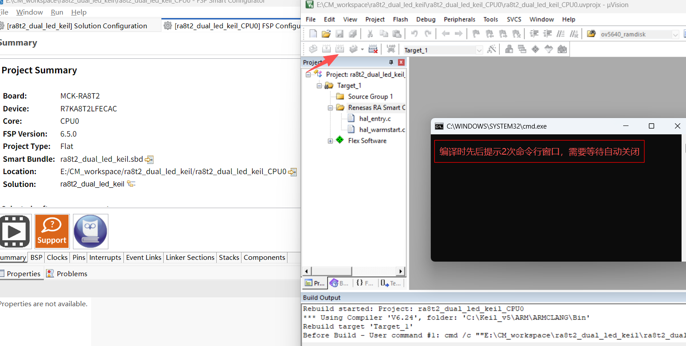


## 步骤 2：调试 CPU0

1. 打开 CPU0 工程
2. 点击 **Debug** 进入调试模式
3. 如果配置了 debug.ini，会同时下载 CPU0 和 CPU1 的代码

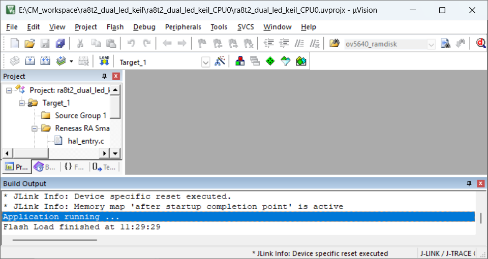

调试时可以查看寄存器状态和反汇编窗口。
**如果未正确配置 OFS，可能会出现可以调试但断点不可见的情况。**

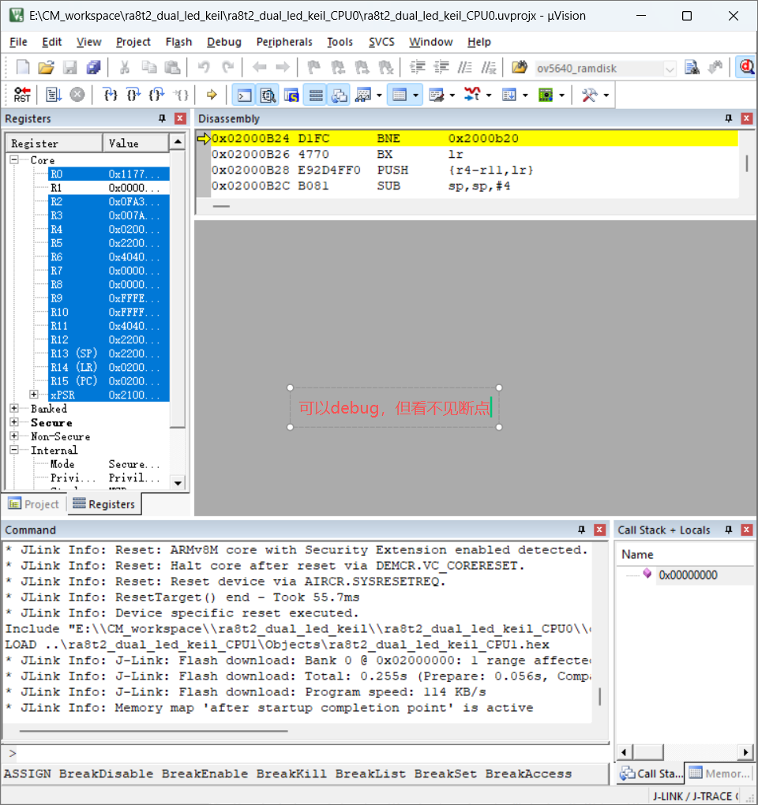

##  步骤 3：OFS disable

**问题：** OFS 配置导致cpu0无法设置断点

**现象：** CPU0 调试时无法停在断点，程序似乎在运行但断点不生效。

**原因：** **keil似乎不支持OFS地址下载。**
OFS1 寄存器中的 Software Debug Control (SWDBG) 位控制看门狗在调试状态下的行为，修改了也没有效果：
- SWDBG = 0：WDT/IWDT 在 CPU 停在断点时继续运行 → 触发复位 → 断点丢失
- SWDBG = 1：WDT/IWDT 在 CPU 停在断点时暂停 → 断点正常工作

**解决方案：** 在 RASC BSP 配置中，禁用以下 OFS 设置：


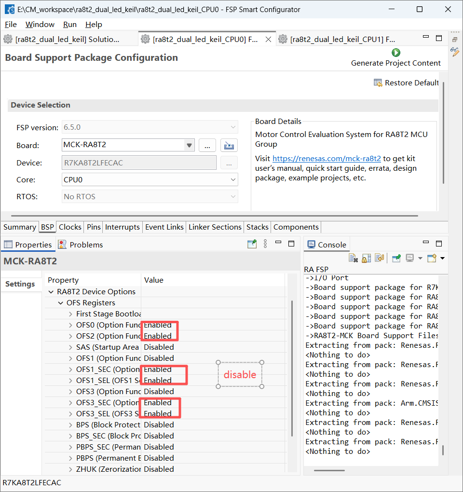
| CPU0 OFS 设置 | 状态 |
|--------------|------|
| OFS0 | Enabled → **Disabled** |
| OFS2 | Enabled → **Disabled** |
| OFS1_SEC | Enabled → **Disabled** |
| OFS1_SEL | Enabled → **Disabled** |
| OFS3_SEC | Enabled → **Disabled** |
| OFS3_SEL | Enabled → **Disabled** |


##  步骤 4：修改cpu0的相关配置
1. **Project → Options for Target → Debug → Settings → Flash Download**
2. 确认 Programming Algorithm：`RA8T2 1M Code MRAM`
3. **RAM for Algorithm**: Start: `0x22000000`, Size: `0x4000`
4. 勾选 **Reset and Run**
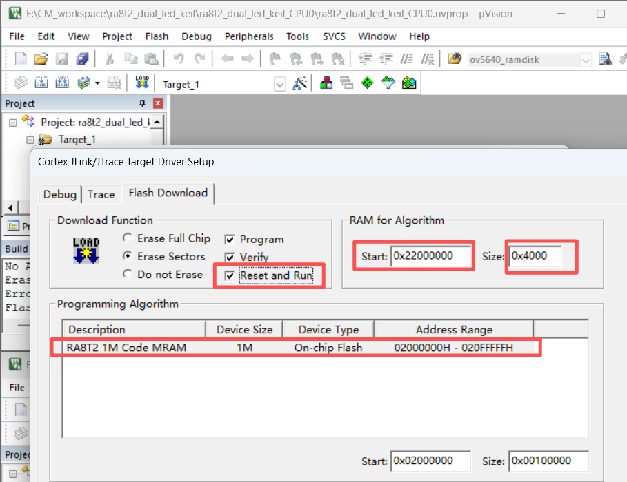

## 步骤 5：CPU0设置断点并调试

1. 在 `main.c` 或 `hal_entry.c` 中设置断点
2. 点击 **Run** 运行程序
3. 程序应在断点处暂停
4. 检查变量值和寄存器状态
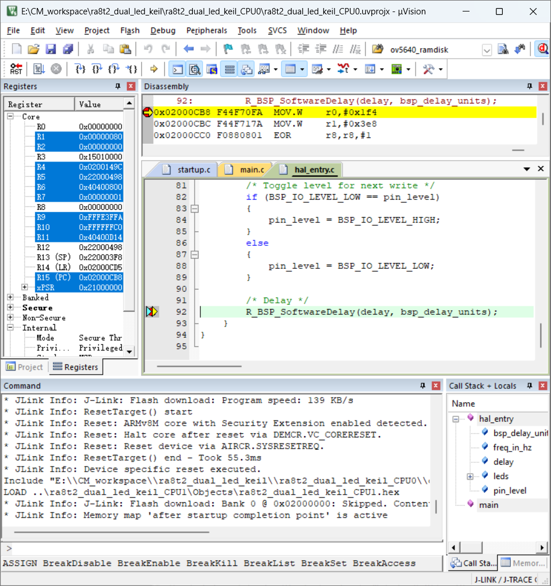

## 步骤 6：查看cpu0的 debug.init文件

能看见下载调试cpu0的同时，会下载cpu1的固件
```ini
LOAD ..\ra8t2_dual_led_keil_CPU1\Objects\ra8t2_dual_led_keil_CPU1.hex
```
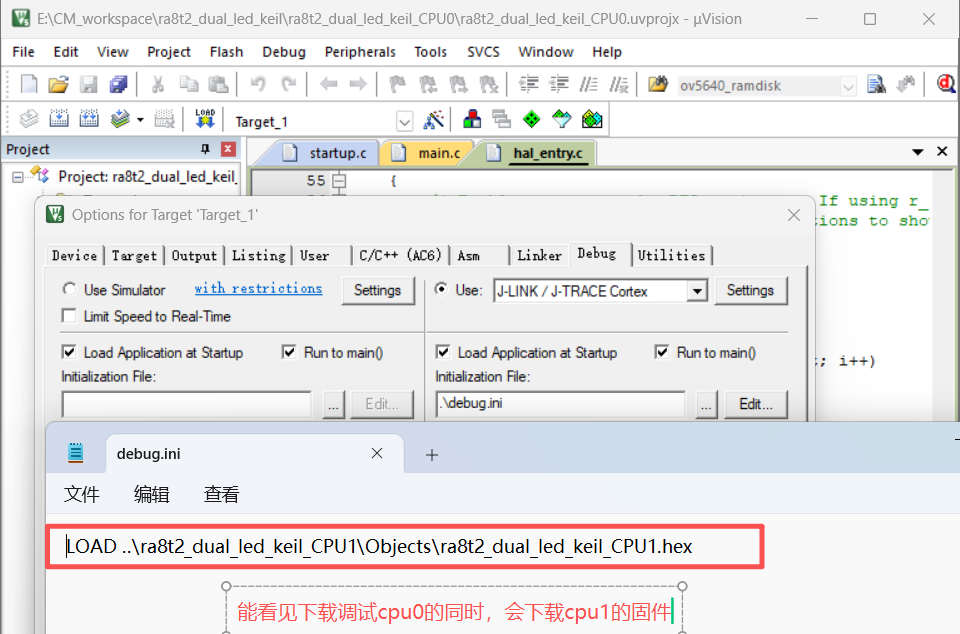

---

# 5. CPU1下载与断点调试

## 步骤 1：打开CPU1 xml文件

**调试cpu1：打开 CPU1 FSP 配置**：CPU0 编译完成后，在 Solution 配置界面中点击 **CPU1** FSP Configuration 选项卡，打开 CPU1 的配置

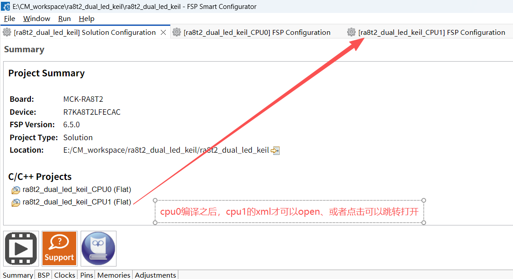

**问题 ：** Smart Bundle 缺失导致cpu1 xml打开失败

**现象：** 打开 CPU1 的 FSP 配置时，提示错误：

```
Smart Bundle file 'Objects/xxx_CPU0.sbd' is missing.
Please either build the preceding project to generate Smart Bundle file.
```

**原因：** CPU1 依赖 CPU0 的 Smart Bundle 文件，需要先编译 CPU0。
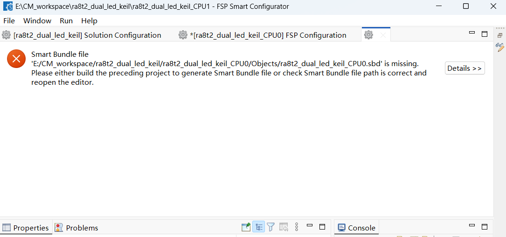
**解决方案：** 先编译 CPU0 工程，再打开 CPU1 的配置。

 **编译 CPU0**：打开 CPU0 工程，点击 **Rebuild**，等待 cmd 窗口自动关闭


## 步骤 2：编译CPU1 

**编译 CPU1**：打开 CPU1 工程，点击 **Rebuild**，等待 cmd 窗口自动关闭（会提示2次脚本调用）

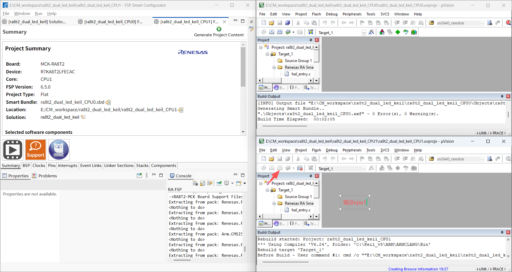


## 步骤 3：编译CPU1断点调试

**问题 ：** CPU1 无法调试断点

**现象：** CPU1 工程没有生成 `.axf` 文件，调试时无法设置断点。

**原因：** CPU1 工程未正确编译，缺少包含调试信息的 ELF 文件。

**解决方案：** 单独编译 CPU1 工程，确保生成 `.axf` 文件。

查看cpu1的 debug.init文件，
需要修改加载axf文件
**CPU1 的 debug.ini**（加载 CPU1 的 axf 文件用于断点调试）：

```ini
LOAD ..\ra8t2_dual_led_keil_CPU1\Objects\ra8t2_dual_led_keil_CPU1.axf INCREMENTAL
```

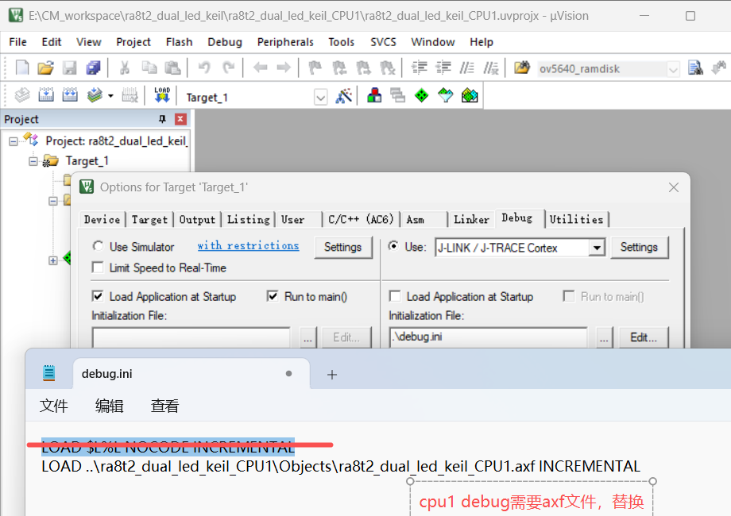
---

## 步骤 4：CPU1配置修改
在 Debug 选项卡中，确认 J-Link/J-Trace 驱动设置，取消勾选 **Verify Code Download** 和 **Download to Flash**（如不需要重复下载）。

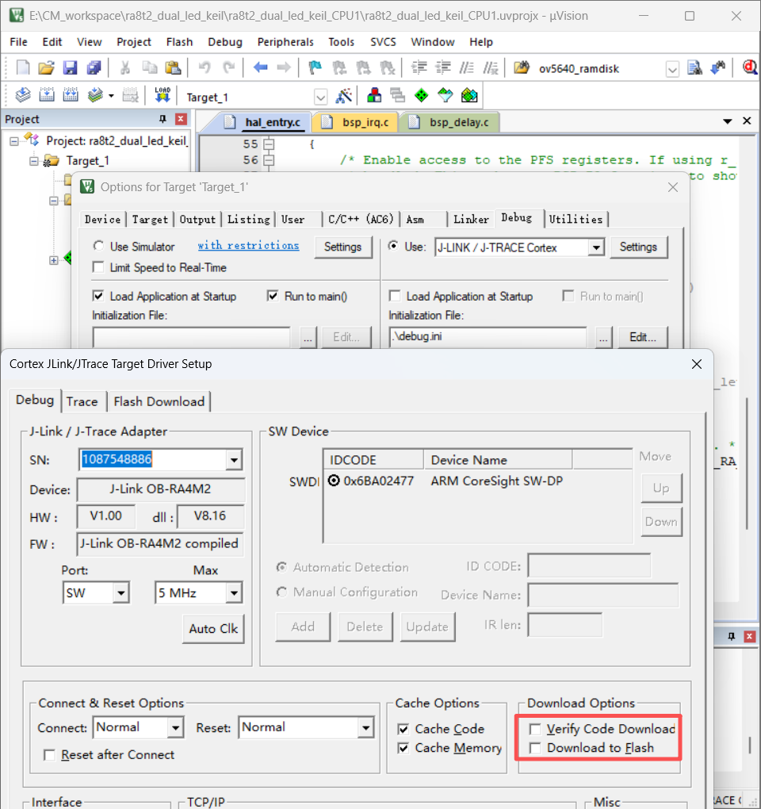


## 步骤 5：CPU1断点调试成功

打开 CPU1 工程并进入调试模式，可以在源代码中设置断点，查看调用栈和变量状态。CPU1 调试支持软件断点和数据观察点。

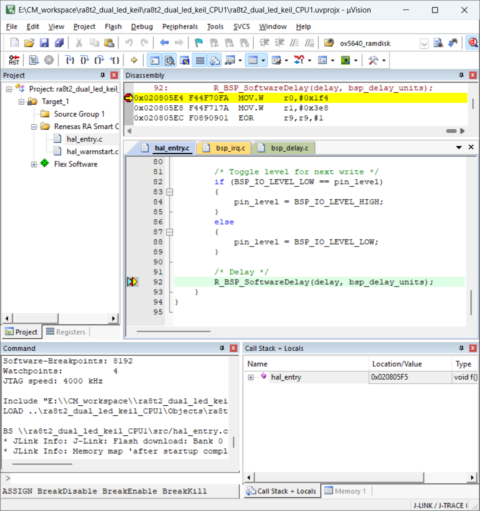


---

# 6. 补充说明

## 6.1 编译器参数（via/rasc_armclang.via）

RASC 生成的编译器参数文件，包含优化等级、警告选项等。如需修改优化等级，可编辑此文件。

## 6.2 Smart Bundle 关系

```
主工程.sbd ← CPU0 引用
CPU0.sbd   ← CPU1 引用（因为 CPU0 是主核）
```

## 6.3 编译顺序

```
1. 编译主工程（生成 solution.xml 等配置）
2. 编译 CPU0（生成 CPU0.sbd）
3. 编译 CPU1（引用 CPU0.sbd）
```


---

**参考资料**

- [RA8T2 Group Datasheet](https://www.renesas.com/en/document/dst/ra8t2-group-datasheet)
- [RA Flexible Software Package (FSP)](https://www.renesas.com/en/software-tool/ra-flexible-software-package-fsp)
- [RA Arm TrustZone Tooling Primer](https://www.renesas.com/en/document/apn/ra-arm-trustzone-tooling-primer)
- [Developing with Dual-Core RA8 MCU](https://www.renesas.com/en/document/apn/developing-dual-core-ra8-mcu)
